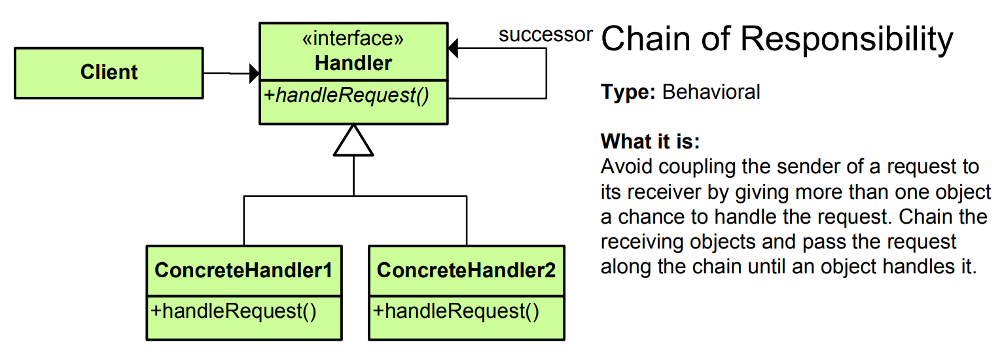

# Chain of Responsibility Pattern - Simple Explanation



## What Is It?

A pattern that **passes a request along a chain of handlers** until one handles it.

Think: Customer support. You call support → agent 1 handles simple issues. If too complex, passes to agent 2. If still complex, passes to agent 3. Request travels down the chain until someone can handle it.

---

## Real Example: Approval Process

```
Manager: Can approve up to $1,000
Director: Can approve up to $10,000
VP: Can approve up to $100,000
CEO: Can approve anything

Request for $5,000:
Manager → "Too high, pass to Director"
Director → "I can handle this! ✓ Approved"

Request for $50,000:
Manager → pass
Director → pass
VP → "I can handle this! ✓ Approved"
```

Request travels down chain until someone can handle it!

---

## The Code

### 1. Handler Interface

```java
public abstract class ApprovalHandler {
    protected ApprovalHandler nextHandler;
    
    public void setNextHandler(ApprovalHandler nextHandler) {
        this.nextHandler = nextHandler;
    }
    
    public abstract void handle(Request request);
}
```

### 2. Concrete Handlers

```java
public class Manager extends ApprovalHandler {
    private double limit = 1000;
    
    @Override
    public void handle(Request request) {
        if (request.getAmount() <= limit) {
            System.out.println("✅ Manager approved: $" + request.getAmount());
        } else {
            System.out.println("❌ Manager cannot approve: $" + request.getAmount() + ", passing to Director...");
            if (nextHandler != null) {
                nextHandler.handle(request);
            }
        }
    }
}

public class Director extends ApprovalHandler {
    private double limit = 10000;
    
    @Override
    public void handle(Request request) {
        if (request.getAmount() <= limit) {
            System.out.println("✅ Director approved: $" + request.getAmount());
        } else {
            System.out.println("❌ Director cannot approve: $" + request.getAmount() + ", passing to VP...");
            if (nextHandler != null) {
                nextHandler.handle(request);
            }
        }
    }
}

public class VP extends ApprovalHandler {
    private double limit = 100000;
    
    @Override
    public void handle(Request request) {
        if (request.getAmount() <= limit) {
            System.out.println("✅ VP approved: $" + request.getAmount());
        } else {
            System.out.println("❌ VP cannot approve: $" + request.getAmount() + ", passing to CEO...");
            if (nextHandler != null) {
                nextHandler.handle(request);
            }
        }
    }
}

public class CEO extends ApprovalHandler {
    @Override
    public void handle(Request request) {
        System.out.println("✅ CEO approved: $" + request.getAmount() + " (unlimited)");
    }
}
```

### 3. Request

```java
public class Request {
    private double amount;
    
    public Request(double amount) {
        this.amount = amount;
    }
    
    public double getAmount() {
        return amount;
    }
}
```

### 4. Use It

```java
public class App {
    public static void main(String[] args) {
        // Build the chain
        ApprovalHandler manager = new Manager();
        ApprovalHandler director = new Director();
        ApprovalHandler vp = new VP();
        ApprovalHandler ceo = new CEO();
        
        // Link them together
        manager.setNextHandler(director);
        director.setNextHandler(vp);
        vp.setNextHandler(ceo);
        
        // Send requests through the chain
        System.out.println("--- Request: $500 ---");
        manager.handle(new Request(500));
        
        System.out.println("\n--- Request: $5,000 ---");
        manager.handle(new Request(5000));
        
        System.out.println("\n--- Request: $50,000 ---");
        manager.handle(new Request(50000));
        
        System.out.println("\n--- Request: $500,000 ---");
        manager.handle(new Request(500000));
        
        // Output:
        // --- Request: $500 ---
        // ✅ Manager approved: $500
        //
        // --- Request: $5,000 ---
        // ❌ Manager cannot approve: $5000, passing to Director...
        // ✅ Director approved: $5000
        //
        // --- Request: $50,000 ---
        // ❌ Manager cannot approve: $50000, passing to Director...
        // ❌ Director cannot approve: $50000, passing to VP...
        // ✅ VP approved: $50000
        //
        // --- Request: $500,000 ---
        // ❌ Manager cannot approve: $500000, passing to Director...
        // ❌ Director cannot approve: $500000, passing to VP...
        // ❌ VP cannot approve: $500000, passing to CEO...
        // ✅ CEO approved: $500000
    }
}
```

---

## Visual

```
Request comes in
    │
    ▼
┌──────────────┐
│   Manager    │ Can handle ≤ $1,000?
│ limit: 1000  │
└──────┬───────┘
       │ No
       ▼
┌──────────────┐
│  Director    │ Can handle ≤ $10,000?
│ limit: 10000 │
└──────┬───────┘
       │ No
       ▼
┌──────────────┐
│     VP       │ Can handle ≤ $100,000?
│ limit: 100000│
└──────┬───────┘
       │ No
       ▼
┌──────────────┐
│     CEO      │ Can handle anything!
│ limit: ∞     │
└──────────────┘

First handler that can handle = processes request!
If can't handle = pass to next!
```

---

## Another Example: Logger

```java
// Handler
public abstract class Logger {
    protected Logger next;
    protected int logLevel;
    
    public static final int INFO = 1;
    public static final int DEBUG = 2;
    public static final int ERROR = 3;
    
    public void setNext(Logger nextLogger) {
        this.next = nextLogger;
    }
    
    public void logMessage(int level, String message) {
        if (this.logLevel <= level) {
            write(message);
        }
        
        if (next != null) {
            next.logMessage(level, message);
        }
    }
    
    protected abstract void write(String message);
}

// Concrete loggers
public class ConsoleLogger extends Logger {
    public ConsoleLogger(int level) {
        this.logLevel = level;
    }
    
    @Override
    protected void write(String message) {
        System.out.println("Console Logger: " + message);
    }
}

public class FileLogger extends Logger {
    public FileLogger(int level) {
        this.logLevel = level;
    }
    
    @Override
    protected void write(String message) {
        System.out.println("File Logger: " + message);
    }
}

public class ErrorLogger extends Logger {
    public ErrorLogger(int level) {
        this.logLevel = level;
    }
    
    @Override
    protected void write(String message) {
        System.out.println("Error Logger: " + message);
    }
}

// Usage
public class App {
    public static void main(String[] args) {
        Logger errorLogger = new ErrorLogger(Logger.ERROR);
        Logger fileLogger = new FileLogger(Logger.DEBUG);
        Logger consoleLogger = new ConsoleLogger(Logger.INFO);
        
        // Build chain: console → file → error
        consoleLogger.setNext(fileLogger);
        fileLogger.setNext(errorLogger);
        
        // Log messages
        consoleLogger.logMessage(Logger.INFO, "This is an info message");
        consoleLogger.logMessage(Logger.DEBUG, "This is a debug message");
        consoleLogger.logMessage(Logger.ERROR, "This is an error message");
    }
}
```

---

## Another Example: HTTP Request Processing

```java
public abstract class Middleware {
    protected Middleware next;
    
    public void linkWith(Middleware next) {
        this.next = next;
    }
    
    public abstract boolean handle(Request request);
}

public class AuthenticationMiddleware extends Middleware {
    @Override
    public boolean handle(Request request) {
        System.out.println("🔐 Checking authentication...");
        
        if (!request.isAuthenticated()) {
            System.out.println("❌ Not authenticated! Blocking request.");
            return false;
        }
        
        System.out.println("✅ Authenticated!");
        return next != null ? next.handle(request) : true;
    }
}

public class AuthorizationMiddleware extends Middleware {
    @Override
    public boolean handle(Request request) {
        System.out.println("🔑 Checking authorization...");
        
        if (!request.hasPermission()) {
            System.out.println("❌ No permission! Blocking request.");
            return false;
        }
        
        System.out.println("✅ Has permission!");
        return next != null ? next.handle(request) : true;
    }
}

public class RateLimitMiddleware extends Middleware {
    @Override
    public boolean handle(Request request) {
        System.out.println("⏱️ Checking rate limit...");
        
        if (request.isRateLimited()) {
            System.out.println("❌ Rate limited! Blocking request.");
            return false;
        }
        
        System.out.println("✅ Rate limit OK!");
        return next != null ? next.handle(request) : true;
    }
}

public class Request {
    private boolean authenticated;
    private boolean hasPermission;
    private boolean rateLimited;
    
    public Request(boolean auth, boolean perm, boolean rate) {
        this.authenticated = auth;
        this.hasPermission = perm;
        this.rateLimited = rate;
    }
    
    public boolean isAuthenticated() { return authenticated; }
    public boolean hasPermission() { return hasPermission; }
    public boolean isRateLimited() { return rateLimited; }
}

// Usage
public class App {
    public static void main(String[] args) {
        Middleware auth = new AuthenticationMiddleware();
        Middleware authz = new AuthorizationMiddleware();
        Middleware rateLimit = new RateLimitMiddleware();
        
        // Build chain
        auth.linkWith(authz);
        authz.linkWith(rateLimit);
        
        // Process request
        Request request = new Request(true, true, false);
        auth.handle(request);
        // Output:
        // 🔐 Checking authentication...
        // ✅ Authenticated!
        // 🔑 Checking authorization...
        // ✅ Has permission!
        // ⏱️ Checking rate limit...
        // ✅ Rate limit OK!
    }
}
```

---

## When to Use?

✅ Multiple handlers can process request  
✅ Handler to be determined at runtime  
✅ Want to decouple sender from receivers  
✅ Processing pipeline (filters, middleware)  
✅ Event handling systems  
✅ Approval/workflow systems

❌ Simple logic with few handlers  
❌ All handlers must be known at compile time  
❌ Performance critical (chain traversal)

---

## Chain of Responsibility vs Similar Patterns

| Pattern | Purpose |
|---------|---------|
| **Chain of Responsibility** | Pass request along chain, first handler processes |
| **Observer** | Notify multiple observers |
| **Command** | Encapsulate request |
| **Mediator** | Centralize communication |

---

## Real-World Examples

- **Approval workflows** (manager → director → VP → CEO)
- **Logger chains** (console → file → error)
- **HTTP middleware** (authentication → authorization → rate limiting)
- **Customer support** (agent 1 → agent 2 → agent 3)
- **Event handling** (parent → child elements in DOM)
- **Exception handling** (try/catch chains)
- **Request routing** (filters in web frameworks)
- **Debugging** (breakpoints, watchpoints, conditional breaks)

---

## Key Benefit

**Decouple sender from handlers, dynamic chain, flexible processing!**

```
Without Chain of Responsibility:
if (handler1.canHandle(request)) {
    handler1.process(request);
} else if (handler2.canHandle(request)) {
    handler2.process(request);
} else if (handler3.canHandle(request)) {
    handler3.process(request);
}
// Tightly coupled, hard to modify!

With Chain of Responsibility:
handler1.handle(request);
// Passes along chain automatically!
// Easy to add/remove handlers!
```

---

## Key Characteristics

✅ Pass request along chain  
✅ Each handler decides: process or pass  
✅ First handler that can process = wins  
✅ Decouple sender from handlers  
✅ Dynamic chain building  
✅ Multiple handlers can process same request

The Chain of Responsibility pattern is perfect for **approval workflows, middleware pipelines, and event handling!** 🔗