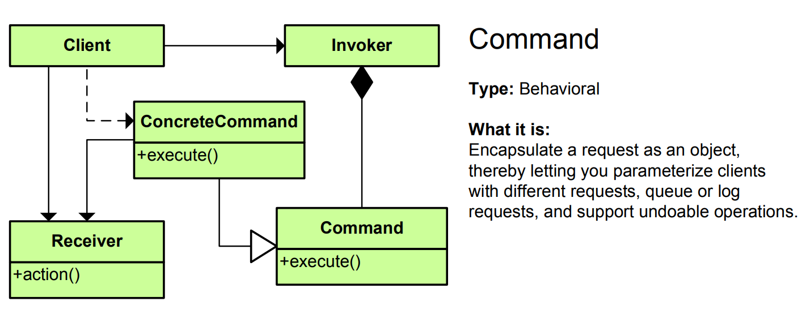

# Command Pattern - Simple Explanation



## What Is It?

A pattern that **encapsulates a request as an object** so you can pass it around, queue it, log it, or undo it.

Think: Remote control. Each button is a command object. Press button → command executes. You can undo the last command, queue commands, etc.

---

## Real Example: Remote Control

Without Command (Bad):
```java
public class RemoteControl {
    public void onButtonPressed(String button) {
        if (button == "power") {
            tv.on();
        } else if (button == "volume_up") {
            tv.volumeUp();
        } else if (button == "mute") {
            tv.mute();
        }
    }
}
// Add new button? Modify this class!
```

With Command (Good):
```java
public class RemoteControl {
    private Command command;
    
    public void setCommand(Command command) {
        this.command = command;
    }
    
    public void pressButton() {
        command.execute();
    }
}

// New button? Just create new command, no changes!
remoteControl.setCommand(new PowerCommand(tv));
remoteControl.pressButton();
```

---

## The Code

### 1. Command Interface

```java
public interface Command {
    void execute();
    void undo();  // Optional but common
}
```

### 2. Concrete Commands

```java
public class PowerCommand implements Command {
    private TV tv;
    
    public PowerCommand(TV tv) {
        this.tv = tv;
    }
    
    @Override
    public void execute() {
        tv.powerOn();
    }
    
    @Override
    public void undo() {
        tv.powerOff();
    }
}

public class VolumeUpCommand implements Command {
    private TV tv;
    private int previousVolume;
    
    public VolumeUpCommand(TV tv) {
        this.tv = tv;
    }
    
    @Override
    public void execute() {
        previousVolume = tv.getVolume();
        tv.setVolume(previousVolume + 1);
    }
    
    @Override
    public void undo() {
        tv.setVolume(previousVolume);
    }
}

public class MuteCommand implements Command {
    private TV tv;
    private int volumeBeforeMute;
    
    public MuteCommand(TV tv) {
        this.tv = tv;
    }
    
    @Override
    public void execute() {
        volumeBeforeMute = tv.getVolume();
        tv.setVolume(0);
    }
    
    @Override
    public void undo() {
        tv.setVolume(volumeBeforeMute);
    }
}
```

### 3. Receiver (The actual object)

```java
public class TV {
    private boolean isOn = false;
    private int volume = 10;
    
    public void powerOn() {
        isOn = true;
        System.out.println("TV is ON");
    }
    
    public void powerOff() {
        isOn = false;
        System.out.println("TV is OFF");
    }
    
    public void setVolume(int volume) {
        this.volume = Math.max(0, Math.min(100, volume));
        System.out.println("Volume: " + this.volume);
    }
    
    public int getVolume() {
        return volume;
    }
}
```

### 4. Invoker (Remote Control)

```java
import java.util.Stack;

public class RemoteControl {
    private Command command;
    private Stack<Command> history = new Stack<>();
    
    public void setCommand(Command command) {
        this.command = command;
    }
    
    public void pressButton() {
        command.execute();
        history.push(command);  // Save for undo
    }
    
    public void undo() {
        if (!history.isEmpty()) {
            Command lastCommand = history.pop();
            lastCommand.undo();
        }
    }
}
```

### 5. Use It

```java
public class App {
    public static void main(String[] args) {
        // Create receiver
        TV tv = new TV();
        
        // Create invoker
        RemoteControl remote = new RemoteControl();
        
        // Create commands
        Command power = new PowerCommand(tv);
        Command volumeUp = new VolumeUpCommand(tv);
        Command mute = new MuteCommand(tv);
        
        // Execute commands
        remote.setCommand(power);
        remote.pressButton();     // TV is ON
        
        remote.setCommand(volumeUp);
        remote.pressButton();     // Volume: 11
        remote.pressButton();     // Volume: 12
        
        remote.setCommand(mute);
        remote.pressButton();     // Volume: 0
        
        // Undo!
        remote.undo();            // Volume: 12
        remote.undo();            // Volume: 11
        remote.undo();            // TV is OFF
    }
}
```

---

## Visual

```
┌──────────────────────────────────┐
│   Client                         │
│   (Wants to execute something)   │
└────────────────┬─────────────────┘
                 │ creates
                 ▼
        ┌────────────────┐
        │    Command     │ (Object encapsulating request)
        │ + execute()    │
        │ + undo()       │
        └────────┬───────┘
                 │ implements
         ┌───────┼───────┬───────────┐
         │       │       │           │
         ▼       ▼       ▼           ▼
    ┌────────┐┌──────┐┌──────┐┌──────────┐
    │PowerCmd││Volume││Mute  ││NewCmd    │
    └────────┘└──────┘└──────┘└──────────┘
         │       │       │           │
         └───────┴───────┴───────────┘
                 │ executes on
                 ▼
        ┌───────────────┐
        │   TV (Receiver)
        │  + powerOn()
        │  + setVolume()
        │  + mute()
        └───────────────┘

RemoteControl (Invoker)
  - Holds command object
  - Calls execute() when button pressed
  - Keeps history for undo
```

---

## Another Example: Text Editor

```java
// Command
public interface EditorCommand {
    void execute();
    void undo();
}

// Concrete commands
public class CutCommand implements EditorCommand {
    private TextEditor editor;
    private String deletedText;
    
    public CutCommand(TextEditor editor) {
        this.editor = editor;
    }
    
    @Override
    public void execute() {
        deletedText = editor.getSelectedText();
        editor.deleteSelectedText();
    }
    
    @Override
    public void undo() {
        editor.insertText(deletedText);
    }
}

public class PasteCommand implements EditorCommand {
    private TextEditor editor;
    private String clipboard;
    
    public PasteCommand(TextEditor editor, String clipboard) {
        this.editor = editor;
        this.clipboard = clipboard;
    }
    
    @Override
    public void execute() {
        editor.insertText(clipboard);
    }
    
    @Override
    public void undo() {
        editor.deleteLastInserted(clipboard.length());
    }
}

// Receiver
public class TextEditor {
    private String text = "";
    
    public void insertText(String str) {
        text += str;
        System.out.println("Text: " + text);
    }
    
    public void deleteSelectedText() {
        System.out.println("Deleting selected text");
    }
    
    public String getSelectedText() {
        return "selected";
    }
}

// Invoker
public class Menu {
    private EditorCommand command;
    private Stack<EditorCommand> history = new Stack<>();
    
    public void setCommand(EditorCommand command) {
        this.command = command;
    }
    
    public void clickCut() {
        command.execute();
        history.push(command);
    }
    
    public void clickUndo() {
        if (!history.isEmpty()) {
            history.pop().undo();
        }
    }
}
```

---

## Another Example: Task Scheduler

```java
public interface Task {
    void execute();
}

public class EmailTask implements Task {
    private String recipient;
    
    public EmailTask(String recipient) {
        this.recipient = recipient;
    }
    
    @Override
    public void execute() {
        System.out.println("Sending email to " + recipient);
    }
}

public class LogTask implements Task {
    private String message;
    
    public LogTask(String message) {
        this.message = message;
    }
    
    @Override
    public void execute() {
        System.out.println("Logging: " + message);
    }
}

public class TaskScheduler {
    private Queue<Task> tasks = new LinkedList<>();
    
    public void scheduleTask(Task task) {
        tasks.add(task);
    }
    
    public void executeTasks() {
        while (!tasks.isEmpty()) {
            Task task = tasks.poll();
            task.execute();
        }
    }
}

// Usage
TaskScheduler scheduler = new TaskScheduler();
scheduler.scheduleTask(new EmailTask("user@email.com"));
scheduler.scheduleTask(new LogTask("Task started"));
scheduler.scheduleTask(new EmailTask("admin@email.com"));
scheduler.executeTasks();  // Execute all in queue
```

---

## When to Use?

✅ Undo/redo functionality  
✅ Task queuing  
✅ Scheduling tasks  
✅ Logging requests  
✅ Macro recording  
✅ Callback/event handling  
✅ Decouple sender from receiver

❌ Simple function calls are clearer  
❌ Overkill for trivial operations

---

## Command vs Similar Patterns

| Pattern | Purpose |
|---------|---------|
| **Command** | Encapsulate request as object, undo/redo |
| **Strategy** | Pick different algorithms |
| **Observer** | Notify multiple objects |
| **State** | Change behavior based on state |

---

## Real-World Examples

- **Text editor** (Ctrl+Z undo, Ctrl+Y redo)
- **Remote control** (button → command)
- **Macro recording** (record commands, replay later)
- **Job queue** (queue commands, execute later)
- **Game replay** (record commands, play back)
- **Undo/redo in databases** (transaction logs)
- **Button actions** (onClick → command)
- **Message queues** (RabbitMQ, Kafka)

---

## Key Benefit

**Encapsulate requests, decouple sender from receiver, enable undo/redo!**

```
Without Command:
button.onClick(() -> {
    tv.powerOn();  // Tightly coupled
});

With Command:
Command power = new PowerCommand(tv);
button.onClick(() -> power.execute());  // Decoupled
button.onUndo(() -> power.undo());      // Undo support!
```

---

## Key Characteristics

✅ Request as object  
✅ Can queue/schedule/log requests  
✅ Undo/redo support  
✅ Decouple invoker from receiver  
✅ Support macros and transactions  
✅ Can add new commands without changing existing code

The Command pattern is perfect for **undo/redo, task scheduling, and request encapsulation!** ↩️