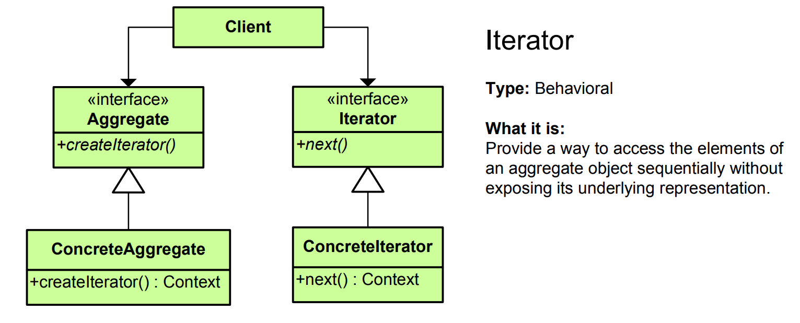

# Iterator Pattern - Simple Explanation




## What Is It?

A pattern that provides a way to **access elements of a collection one-by-one** without exposing the underlying structure.

Think: TV remote. You press "next" to go through channels one-by-one. You don't care if channels are stored in a list, array, or database. The remote just says "give me next channel".

---

## Real Example: Book Collection

Without Iterator (Bad):
```java
// Have to know structure
if (bookCollection is Array) {
    for (int i = 0; i < array.length; i++) {
        process(array[i]);
    }
} else if (bookCollection is LinkedList) {
    for (Book book : linkedList) {
        process(book);
    }
} else if (bookCollection is Tree) {
    // different traversal
}
// Messy! Depends on structure!
```

With Iterator (Good):
```java
Iterator<Book> iterator = bookCollection.iterator();
while (iterator.hasNext()) {
    Book book = iterator.next();
    process(book);
}
// Works for ANY collection! Don't care about structure!
```

---

## The Code

### 1. Iterator Interface

```java
public interface Iterator<T> {
    boolean hasNext();
    T next();
    void remove();  // Optional
}
```

### 2. Collection Interface

```java
public interface Collection<T> {
    Iterator<T> iterator();
}
```

### 3. Concrete Collection (Array-based)

```java
public class BookCollection implements Collection<Book> {
    private Book[] books;
    private int size = 0;
    
    public BookCollection(int capacity) {
        books = new Book[capacity];
    }
    
    public void addBook(Book book) {
        if (size < books.length) {
            books[size++] = book;
        }
    }
    
    @Override
    public Iterator<Book> iterator() {
        return new BookIterator();
    }
    
    // Inner class - Iterator
    private class BookIterator implements Iterator<Book> {
        private int currentIndex = 0;
        
        @Override
        public boolean hasNext() {
            return currentIndex < size;
        }
        
        @Override
        public Book next() {
            if (!hasNext()) {
                throw new java.util.NoSuchElementException();
            }
            return books[currentIndex++];
        }
        
        @Override
        public void remove() {
            // Implementation to remove current element
        }
    }
}
```

### 4. Book Class

```java
public class Book {
    private String title;
    private String author;
    
    public Book(String title, String author) {
        this.title = title;
        this.author = author;
    }
    
    @Override
    public String toString() {
        return title + " by " + author;
    }
}
```

### 5. Use It

```java
public class App {
    public static void main(String[] args) {
        BookCollection collection = new BookCollection(10);
        collection.addBook(new Book("1984", "George Orwell"));
        collection.addBook(new Book("To Kill a Mockingbird", "Harper Lee"));
        collection.addBook(new Book("The Great Gatsby", "F. Scott Fitzgerald"));
        collection.addBook(new Book("Brave New World", "Aldous Huxley"));
        
        // Iterate through collection
        Iterator<Book> iterator = collection.iterator();
        while (iterator.hasNext()) {
            System.out.println(iterator.next());
        }
        
        // Output:
        // 1984 by George Orwell
        // To Kill a Mockingbird by Harper Lee
        // The Great Gatsby by F. Scott Fitzgerald
        // Brave New World by Aldous Huxley
    }
}
```

---

## Visual

```
WITHOUT ITERATOR (Tightly coupled):
┌─────────────────────────┐
│  Client Code            │
│  - knows array syntax   │
│  - knows for loop       │
│  - depends on structure │
└────────────┬────────────┘
             │
             ▼
     ┌──────────────┐
     │ BookArray    │
     │ - index: 0   │
     │ - data: [..]│
     └──────────────┘

WITH ITERATOR (Decoupled):
┌──────────────────────┐
│  Client Code         │
│  iterator.next()     │
│  (doesn't care how)  │
└────────────┬─────────┘
             │
             ▼
    ┌────────────────┐
    │ Iterator       │
    │ + hasNext()    │
    │ + next()       │
    └────────┬───────┘
             │ implements
   ┌─────────┼─────────┐
   │         │         │
   ▼         ▼         ▼
┌─────┐ ┌────────┐ ┌──────┐
│Array│ │Linked  │ │ Tree │
│Iter.│ │List    │ │Iter. │
│     │ │Iter.   │ │      │
└─────┘ └────────┘ └──────┘

Same client code works for ALL!
```

---

## Another Example: File System Iterator

```java
// Iterator
public interface FileIterator {
    boolean hasNext();
    File next();
}

// Collection
public interface FileCollection {
    FileIterator iterator();
}

// Concrete collection for folder
public class Folder implements FileCollection {
    private File[] files;
    private int size = 0;
    
    public Folder(int capacity) {
        files = new File[capacity];
    }
    
    public void addFile(File file) {
        if (size < files.length) {
            files[size++] = file;
        }
    }
    
    @Override
    public FileIterator iterator() {
        return new FolderIterator();
    }
    
    private class FolderIterator implements FileIterator {
        private int index = 0;
        
        @Override
        public boolean hasNext() {
            return index < size;
        }
        
        @Override
        public File next() {
            return files[index++];
        }
    }
}

// Another collection for linked list based storage
public class DynamicFolder implements FileCollection {
    private java.util.LinkedList<File> files = new java.util.LinkedList<>();
    
    public void addFile(File file) {
        files.add(file);
    }
    
    @Override
    public FileIterator iterator() {
        return new LinkedListIterator();
    }
    
    private class LinkedListIterator implements FileIterator {
        private java.util.Iterator<File> iter = files.iterator();
        
        @Override
        public boolean hasNext() {
            return iter.hasNext();
        }
        
        @Override
        public File next() {
            return iter.next();
        }
    }
}

// Same client code works for both!
public class App {
    public static void main(String[] args) {
        // Works with array-based folder
        Folder arrayFolder = new Folder(10);
        arrayFolder.addFile(new File("doc1.txt"));
        arrayFolder.addFile(new File("doc2.txt"));
        
        printFiles(arrayFolder);
        
        // Also works with linked-list based folder
        DynamicFolder linkedFolder = new DynamicFolder();
        linkedFolder.addFile(new File("file1.pdf"));
        linkedFolder.addFile(new File("file2.pdf"));
        
        printFiles(linkedFolder);
    }
    
    static void printFiles(FileCollection collection) {
        FileIterator iterator = collection.iterator();
        while (iterator.hasNext()) {
            System.out.println(iterator.next());
        }
    }
}

public class File {
    private String name;
    
    public File(String name) {
        this.name = name;
    }
    
    @Override
    public String toString() {
        return name;
    }
}
```

---

## Another Example: Student Roster

```java
public interface StudentIterator {
    boolean hasNext();
    Student next();
}

public interface StudentCollection {
    StudentIterator iterator();
}

public class Classroom implements StudentCollection {
    private Student[] students;
    private int count = 0;
    
    public Classroom(int size) {
        students = new Student[size];
    }
    
    public void addStudent(Student student) {
        if (count < students.length) {
            students[count++] = student;
        }
    }
    
    @Override
    public StudentIterator iterator() {
        return new ClassroomIterator();
    }
    
    private class ClassroomIterator implements StudentIterator {
        private int currentIndex = 0;
        
        @Override
        public boolean hasNext() {
            return currentIndex < count;
        }
        
        @Override
        public Student next() {
            return students[currentIndex++];
        }
    }
}

public class Student {
    private String name;
    private double gpa;
    
    public Student(String name, double gpa) {
        this.name = name;
        this.gpa = gpa;
    }
    
    @Override
    public String toString() {
        return name + " (GPA: " + gpa + ")";
    }
}

// Usage
public class App {
    public static void main(String[] args) {
        Classroom classroom = new Classroom(20);
        classroom.addStudent(new Student("Alice", 3.8));
        classroom.addStudent(new Student("Bob", 3.5));
        classroom.addStudent(new Student("Charlie", 3.9));
        
        // Iterate through students
        StudentIterator iterator = classroom.iterator();
        while (iterator.hasNext()) {
            System.out.println(iterator.next());
        }
    }
}
```

---

## Java Built-in Iterator

Java has built-in Iterator support:

```java
// Collections implement Iterable
List<String> names = new ArrayList<>();
names.add("Alice");
names.add("Bob");
names.add("Charlie");

// Method 1: Using iterator() explicitly
Iterator<String> iterator = names.iterator();
while (iterator.hasNext()) {
    System.out.println(iterator.next());
}

// Method 2: Using for-each (syntactic sugar)
for (String name : names) {
    System.out.println(name);
}

// Method 3: forEach() method
names.forEach(System.out::println);
```

---

## When to Use?

✅ Need to traverse collection without knowing structure  
✅ Support different traversal methods  
✅ Decouple client from collection structure  
✅ Multiple collections with same interface  
✅ Hide internal representation

❌ Simple collections (access by index is fine)  
❌ Single collection type  
❌ Performance critical (iteration overhead)

---

## Iterator vs Similar Patterns

| Pattern | Purpose |
|---------|---------|
| **Iterator** | Access collection elements sequentially |
| **Visitor** | Perform operations on collection elements |
| **Strategy** | Pick different algorithms |
| **Composite** | Tree traversal |

---

## Real-World Examples

- **Array/List iteration** (for-each loop in Java)
- **Database cursors** (fetch records one-by-one)
- **File system traversal** (walk through directories)
- **UI controls** (iterate through children)
- **Streaming APIs** (process data streams)
- **Game entity management** (iterate through all entities)
- **Event listeners** (iterate through handlers)
- **Lazy evaluation** (generators, Python yields)

---

## Key Benefit

**Access collection elements without knowing the internal structure!**

```
Without Iterator:
for (int i = 0; i < array.length; i++) {
    process(array[i]);  // Only for arrays!
}

With Iterator:
Iterator<T> it = collection.iterator();
while (it.hasNext()) {
    process(it.next());  // Works for any collection!
}
```

---

## Key Characteristics

✅ Sequential access  
✅ Hides internal structure  
✅ Works for any collection type  
✅ Client doesn't know storage method  
✅ Easy to add new collection types  
✅ Standard interface (hasNext(), next())

The Iterator pattern is perfect for **uniform collection access!** 🔄