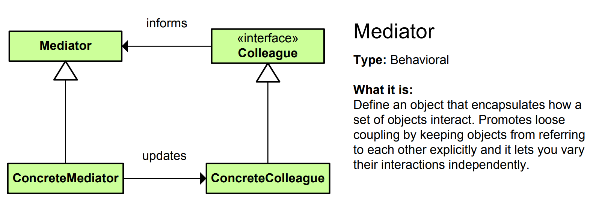

# Mediator Pattern - Simple Explanation




## What Is It?

A pattern that **centralizes complex communication between objects** so they don't talk directly to each other.

Think: Airport control tower. Planes don't talk to each other directly. They all talk to the control tower, which coordinates landing, takeoff, routes. The tower is the mediator!

---

## Real Example: Chat Room

Without Mediator (Bad):
```
User1 sends message to User2, User3, User4, User5...
User2 sends message to User1, User3, User4, User5...
User3 sends message to User1, User2, User4, User5...
(Everyone talks to everyone = chaos!)

If we add User6:
Every user must know User6!
Every user must send to User6!
(Nightmare!)
```

With Mediator (Good):
```
User1 sends to ChatRoom
User2 sends to ChatRoom
User3 sends to ChatRoom
User4 sends to ChatRoom
ChatRoom distributes to all

Add User5?
Just add to ChatRoom!
Users don't change!
```

---

## The Code

### 1. Mediator Interface

```java
public interface ChatRoom {
    void sendMessage(String message, User sender);
    void addUser(User user);
    void removeUser(User user);
}
```

### 2. Concrete Mediator

```java
import java.util.ArrayList;
import java.util.List;

public class ChatRoomImpl implements ChatRoom {
    private List<User> users = new ArrayList<>();
    
    @Override
    public void addUser(User user) {
        users.add(user);
        System.out.println("✅ " + user.getName() + " joined the chat");
    }
    
    @Override
    public void removeUser(User user) {
        users.remove(user);
        System.out.println("❌ " + user.getName() + " left the chat");
    }
    
    @Override
    public void sendMessage(String message, User sender) {
        // Distribute message to all users except sender
        for (User user : users) {
            if (user != sender) {
                user.receiveMessage(sender.getName() + ": " + message);
            }
        }
    }
}
```

### 3. Colleague (User)

```java
public class User {
    private String name;
    private ChatRoom chatRoom;
    
    public User(String name, ChatRoom chatRoom) {
        this.name = name;
        this.chatRoom = chatRoom;
    }
    
    public String getName() {
        return name;
    }
    
    // Send message through mediator
    public void sendMessage(String message) {
        System.out.println(name + " sends: " + message);
        chatRoom.sendMessage(message, this);
    }
    
    // Receive message from mediator
    public void receiveMessage(String message) {
        System.out.println(name + " receives: " + message);
    }
}
```

### 4. Use It

```java
public class App {
    public static void main(String[] args) {
        // Create mediator (chat room)
        ChatRoom chatRoom = new ChatRoomImpl();
        
        // Create users
        User alice = new User("Alice", chatRoom);
        User bob = new User("Bob", chatRoom);
        User charlie = new User("Charlie", chatRoom);
        
        // Add users to chat room
        chatRoom.addUser(alice);
        chatRoom.addUser(bob);
        chatRoom.addUser(charlie);
        
        System.out.println();
        
        // Send messages through mediator
        alice.sendMessage("Hello everyone!");
        
        System.out.println();
        
        bob.sendMessage("Hi Alice!");
        
        System.out.println();
        
        charlie.sendMessage("Hey, how are you?");
        
        // Output:
        // ✅ Alice joined the chat
        // ✅ Bob joined the chat
        // ✅ Charlie joined the chat
        //
        // Alice sends: Hello everyone!
        // Bob receives: Alice: Hello everyone!
        // Charlie receives: Alice: Hello everyone!
        //
        // Bob sends: Hi Alice!
        // Alice receives: Bob: Hi Alice!
        // Charlie receives: Bob: Hi Alice!
        //
        // Charlie sends: Hey, how are you?
        // Alice receives: Charlie: Hey, how are you?
        // Bob receives: Charlie: Hey, how are you?
    }
}
```

---

## Visual

```
WITHOUT MEDIATOR (Chaos):
    ┌─────┐
    │Alice│
    └──┬──┘
       │ knows Bob, Charlie, Diana...
       │
    ┌──▼──┐         ┌───────┐
    │ Bob ├────────►│Charlie│
    └──┬──┘         └───┬───┘
       │                │
       └────────────────┘
    Everyone talks to everyone!
    Add new user = modify all!

WITH MEDIATOR (Clean):
    ┌─────┐       ┌───────┐       ┌─────┐
    │Alice├──────►│ChatRM │◄──────┤ Bob │
    └─────┘       │(Media)│       └─────┘
                  │ tor   │
    ┌───────┐     └───────┘       ┌─────┐
    │Charlie├────────────────────►│Diana│
    └───────┘                     └─────┘

All users talk to ChatRoom!
ChatRoom coordinates!
Add new user = just add to ChatRoom!
```

---

## Another Example: Air Traffic Control

```java
// Mediator
public interface AirTrafficControl {
    void registerAirplane(Airplane airplane);
    void requestLanding(Airplane airplane);
    void requestTakeoff(Airplane airplane);
    void notifyAirplanes(String message);
}

// Concrete Mediator
public class ControlTower implements AirTrafficControl {
    private java.util.List<Airplane> airplanes = new java.util.ArrayList<>();
    private java.util.Queue<Airplane> landingQueue = new java.util.LinkedList<>();
    
    @Override
    public void registerAirplane(Airplane airplane) {
        airplanes.add(airplane);
        System.out.println("🛫 " + airplane.getId() + " registered with control tower");
    }
    
    @Override
    public void requestLanding(Airplane airplane) {
        System.out.println("📡 " + airplane.getId() + " requests landing");
        
        if (landingQueue.isEmpty()) {
            System.out.println("✅ " + airplane.getId() + " cleared to land immediately!");
            airplane.land();
        } else {
            landingQueue.add(airplane);
            System.out.println("⏳ " + airplane.getId() + " queued for landing. Position: " + 
                              landingQueue.size());
        }
    }
    
    @Override
    public void requestTakeoff(Airplane airplane) {
        System.out.println("📡 " + airplane.getId() + " requests takeoff");
        System.out.println("✅ " + airplane.getId() + " cleared for takeoff!");
        airplane.takeoff();
    }
    
    @Override
    public void notifyAirplanes(String message) {
        for (Airplane airplane : airplanes) {
            airplane.receiveMessage(message);
        }
    }
}

// Colleague
public class Airplane {
    private String id;
    private AirTrafficControl control;
    
    public Airplane(String id, AirTrafficControl control) {
        this.id = id;
        this.control = control;
    }
    
    public String getId() {
        return id;
    }
    
    public void requestLanding() {
        control.requestLanding(this);
    }
    
    public void land() {
        System.out.println("🛬 " + id + " is landing...");
    }
    
    public void requestTakeoff() {
        control.requestTakeoff(this);
    }
    
    public void takeoff() {
        System.out.println("✈️ " + id + " is taking off...");
    }
    
    public void receiveMessage(String message) {
        System.out.println(id + " receives: " + message);
    }
}

// Usage
public class App {
    public static void main(String[] args) {
        AirTrafficControl tower = new ControlTower();
        
        Airplane flight1 = new Airplane("AA101", tower);
        Airplane flight2 = new Airplane("UA202", tower);
        Airplane flight3 = new Airplane("DL303", tower);
        
        tower.registerAirplane(flight1);
        tower.registerAirplane(flight2);
        tower.registerAirplane(flight3);
        
        System.out.println();
        
        // Airplanes don't talk to each other!
        // They talk to control tower!
        flight1.requestTakeoff();
        flight2.requestLanding();
        flight3.requestLanding();
    }
}
```

---

## Another Example: UI Dialog Components

```java
// Mediator
public interface DialogMediator {
    void registerComponent(Component component);
    void notifyChange(Component component);
}

// Concrete Mediator
public class LoginDialog implements DialogMediator {
    private TextField username;
    private PasswordField password;
    private Button okButton;
    private Button cancelButton;
    
    @Override
    public void registerComponent(Component component) {
        if (component instanceof TextField) {
            username = (TextField) component;
        } else if (component instanceof PasswordField) {
            password = (PasswordField) component;
        } else if (component instanceof Button) {
            // Register button
        }
    }
    
    @Override
    public void notifyChange(Component component) {
        if (component == username || component == password) {
            // If both fields have content, enable OK button
            if (username.isEmpty() || password.isEmpty()) {
                okButton.disable();
            } else {
                okButton.enable();
            }
        }
    }
}

// Components don't know about each other
// They only know the mediator
public abstract class Component {
    protected DialogMediator mediator;
    
    public Component(DialogMediator mediator) {
        this.mediator = mediator;
    }
    
    public void changed() {
        mediator.notifyChange(this);
    }
}

public class TextField extends Component {
    private String text = "";
    
    public TextField(DialogMediator mediator) {
        super(mediator);
    }
    
    public void setText(String text) {
        this.text = text;
        changed();  // Notify mediator
    }
    
    public boolean isEmpty() {
        return text.isEmpty();
    }
}

public class PasswordField extends Component {
    private String password = "";
    
    public PasswordField(DialogMediator mediator) {
        super(mediator);
    }
    
    public void setPassword(String pwd) {
        this.password = pwd;
        changed();  // Notify mediator
    }
    
    public boolean isEmpty() {
        return password.isEmpty();
    }
}

public class Button extends Component {
    private String label;
    private boolean enabled = false;
    
    public Button(String label, DialogMediator mediator) {
        super(mediator);
        this.label = label;
    }
    
    public void enable() {
        enabled = true;
        System.out.println(label + " button enabled");
    }
    
    public void disable() {
        enabled = false;
        System.out.println(label + " button disabled");
    }
}
```

---

## When to Use?

✅ Many objects communicate in complex ways  
✅ Reusing objects is difficult due to many dependencies  
✅ Behavior distributed among classes should be customizable  
✅ Objects are tightly coupled  
✅ Many-to-many relationships between objects

❌ Simple communication patterns  
❌ Few objects  
❌ Direct communication is clearer

---

## Mediator vs Similar Patterns

| Pattern | Purpose |
|---------|---------|
| **Mediator** | Centralize complex communication |
| **Observer** | One-to-many notification |
| **Facade** | Simplify complex system |
| **Chain of Responsibility** | Pass request along chain |

---

## Key Difference: Mediator vs Observer

```
MEDIATOR:
- Many-to-many communication
- Mediator actively controls communication
- Colleagues don't know each other
- Example: Chat room (users don't know each other)

OBSERVER:
- One-to-many notification
- Subject just notifies (passive)
- Observers know they're observing
- Example: Stock price change notification
```

---

## Real-World Examples

- **Chat rooms** (users through central room)
- **Air traffic control** (planes through control tower)
- **Restaurant kitchen** (waiters through order system)
- **Dialog boxes** (components through mediator)
- **Game lobbies** (players through lobby server)
- **Stock exchange** (traders through exchange mediator)
- **MVC framework** (controller mediates model/view)
- **Messaging systems** (message broker)

---

## Key Benefit

**Decouple objects, centralize communication logic, easy to modify interaction rules!**

```
Without Mediator:
User1 sends to User2, User3, User4...
User2 sends to User1, User3, User4...
(Tightly coupled, hard to change!)

With Mediator:
All users send to ChatRoom
ChatRoom distributes messages
(Loosely coupled, easy to change!)
```

---

## Key Characteristics

✅ Centralized communication  
✅ Objects don't reference each other  
✅ Many-to-many relationships  
✅ Interaction logic in one place  
✅ Easy to modify communication  
✅ Reduce object dependencies

The Mediator pattern is perfect for **complex multi-object communication!** 🎯