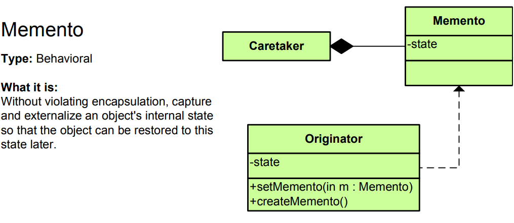

# Memento Pattern - Simple Explanation



## What Is It?

A pattern that **captures and saves an object's state** so you can restore it later, without violating encapsulation.

Think: Saving a video game. You save the entire game state (health, inventory, position). Later, you load that save and everything is restored exactly as it was. The save file is the "memento"!

---

## Real Example: Text Editor

Without Memento (Bad):
```java
// Can't undo - state is lost!
textEditor.setText("Hello");
textEditor.setText("Hello World");
// Can't go back to "Hello"!
```

With Memento (Good):
```java
// Save state
Memento memento1 = editor.save();
editor.setText("Hello");

Memento memento2 = editor.save();
editor.setText("Hello World");

// Restore to earlier state
editor.restore(memento1);  // Back to "Hello"
```

---

## The Code

### 1. Memento (Immutable snapshot)

```java
public class Memento {
    private final String text;
    private final int cursorPosition;
    
    public Memento(String text, int cursorPosition) {
        this.text = text;
        this.cursorPosition = cursorPosition;
    }
    
    public String getText() {
        return text;
    }
    
    public int getCursorPosition() {
        return cursorPosition;
    }
}
```

### 2. Originator (Object whose state we save)

```java
public class TextEditor {
    private String text = "";
    private int cursorPosition = 0;
    
    public void setText(String text) {
        this.text = text;
        this.cursorPosition = text.length();
        System.out.println("Text changed to: " + text);
    }
    
    public void setCursorPosition(int position) {
        this.cursorPosition = position;
        System.out.println("Cursor at: " + position);
    }
    
    // Save current state to memento
    public Memento save() {
        System.out.println("💾 Saving state...");
        return new Memento(text, cursorPosition);
    }
    
    // Restore state from memento
    public void restore(Memento memento) {
        this.text = memento.getText();
        this.cursorPosition = memento.getCursorPosition();
        System.out.println("♻️ Restored to: " + text + " (cursor at " + cursorPosition + ")");
    }
    
    public void show() {
        System.out.println("Text: '" + text + "' | Cursor: " + cursorPosition);
    }
}
```

### 3. Caretaker (Manages mementos)

```java
import java.util.Stack;

public class EditorHistory {
    private Stack<Memento> history = new Stack<>();
    
    public void saveState(TextEditor editor) {
        history.push(editor.save());
    }
    
    public void undo(TextEditor editor) {
        if (!history.isEmpty()) {
            Memento memento = history.pop();
            editor.restore(memento);
        } else {
            System.out.println("❌ No history to undo!");
        }
    }
    
    public void showHistory() {
        System.out.println("History size: " + history.size());
    }
}
```

### 4. Use It

```java
public class App {
    public static void main(String[] args) {
        TextEditor editor = new TextEditor();
        EditorHistory history = new EditorHistory();
        
        // Make changes and save
        editor.setText("Hello");
        history.saveState(editor);
        editor.show();
        
        System.out.println();
        
        editor.setText("Hello World");
        history.saveState(editor);
        editor.show();
        
        System.out.println();
        
        editor.setText("Hello World!");
        history.saveState(editor);
        editor.show();
        
        System.out.println("\n--- Undo ---\n");
        
        history.undo(editor);  // Back to "Hello World"
        editor.show();
        
        System.out.println();
        
        history.undo(editor);  // Back to "Hello"
        editor.show();
        
        // Output:
        // Text changed to: Hello
        // 💾 Saving state...
        // Text: 'Hello' | Cursor: 5
        //
        // Text changed to: Hello World
        // 💾 Saving state...
        // Text: 'Hello World' | Cursor: 11
        //
        // Text changed to: Hello World!
        // 💾 Saving state...
        // Text: 'Hello World!' | Cursor: 12
        //
        // --- Undo ---
        //
        // ♻️ Restored to: Hello World (cursor at 11)
        // Text: 'Hello World' | Cursor: 11
        //
        // ♻️ Restored to: Hello (cursor at 5)
        // Text: 'Hello' | Cursor: 5
    }
}
```

---

## Visual

```
WITHOUT MEMENTO (State lost):
┌──────────────┐
│ TextEditor   │
│ text="Hello" │
└──────────────┘
      │
      ▼ (setText)
┌──────────────────┐
│ TextEditor       │
│ text="World"     │ ◄─── Old state lost!
└──────────────────┘

WITH MEMENTO (State saved):
Step 1: Save
┌──────────────┐      ┌─────────────┐
│ TextEditor   │──────┤ Memento 1   │
│ "Hello"      │      │ "Hello"     │
└──────────────┘      └─────────────┘

Step 2: Change
┌──────────────┐      ┌─────────────┐
│ TextEditor   │      │ Memento 1   │
│ "World"      │      │ "Hello"     │ ◄─── Saved!
└──────────────┘      └─────────────┘

Step 3: Restore
┌──────────────┐      ┌─────────────┐
│ TextEditor   │◄─────│ Memento 1   │
│ "Hello"      │      │ "Hello"     │
└──────────────┘      └─────────────┘
```

---

## Another Example: Game Save/Load

```java
// Memento - immutable snapshot
public class GameState {
    private final int health;
    private final int score;
    private final String position;
    private final java.util.Map<String, Integer> inventory;
    
    public GameState(int health, int score, String position, 
                     java.util.Map<String, Integer> inventory) {
        this.health = health;
        this.score = score;
        this.position = position;
        this.inventory = new java.util.HashMap<>(inventory);
    }
    
    public int getHealth() { return health; }
    public int getScore() { return score; }
    public String getPosition() { return position; }
    public java.util.Map<String, Integer> getInventory() { return inventory; }
}

// Originator - game
public class Game {
    private int health = 100;
    private int score = 0;
    private String position = "Start";
    private java.util.Map<String, Integer> inventory = new java.util.HashMap<>();
    
    public void takeDamage(int damage) {
        health -= damage;
        System.out.println("💢 Taking " + damage + " damage. Health: " + health);
    }
    
    public void gainScore(int points) {
        score += points;
        System.out.println("⭐ Gained " + points + " points. Score: " + score);
    }
    
    public void move(String newPosition) {
        position = newPosition;
        System.out.println("🚶 Moved to: " + position);
    }
    
    public void addItem(String item, int quantity) {
        inventory.put(item, inventory.getOrDefault(item, 0) + quantity);
        System.out.println("📦 Added " + quantity + " " + item);
    }
    
    // Save state
    public GameState save() {
        System.out.println("💾 Saving game...");
        return new GameState(health, score, position, inventory);
    }
    
    // Restore state
    public void load(GameState state) {
        this.health = state.getHealth();
        this.score = state.getScore();
        this.position = state.getPosition();
        this.inventory = state.getInventory();
        System.out.println("♻️ Game loaded!");
    }
    
    public void showStatus() {
        System.out.println("❤️ Health: " + health + " | ⭐ Score: " + score + 
                          " | 📍 Position: " + position + " | 📦 Items: " + inventory);
    }
}

// Caretaker - manages saves
public class SaveManager {
    private java.util.Map<String, GameState> saves = new java.util.HashMap<>();
    
    public void saveGame(String slotName, Game game) {
        saves.put(slotName, game.save());
        System.out.println("✅ Game saved to slot: " + slotName);
    }
    
    public void loadGame(String slotName, Game game) {
        if (saves.containsKey(slotName)) {
            game.load(saves.get(slotName));
            System.out.println("✅ Game loaded from slot: " + slotName);
        } else {
            System.out.println("❌ No save found in slot: " + slotName);
        }
    }
}

// Usage
public class App {
    public static void main(String[] args) {
        Game game = new Game();
        SaveManager manager = new SaveManager();
        
        // Play
        game.gainScore(100);
        game.move("Forest");
        game.addItem("Sword", 1);
        game.showStatus();
        
        System.out.println();
        
        // Save
        manager.saveGame("Slot1", game);
        
        System.out.println();
        
        // Continue playing (dangerous path)
        game.takeDamage(50);
        game.move("Dragon Lair");
        game.takeDamage(100);  // Oops, died!
        game.showStatus();
        
        System.out.println();
        
        // Load from save
        manager.loadGame("Slot1", game);
        game.showStatus();
    }
}
```

---

## Another Example: Browser History

```java
// Memento
public class PageMemento {
    private final String url;
    private final String title;
    private final String content;
    private final long timestamp;
    
    public PageMemento(String url, String title, String content) {
        this.url = url;
        this.title = title;
        this.content = content;
        this.timestamp = System.currentTimeMillis();
    }
    
    public String getUrl() { return url; }
    public String getTitle() { return title; }
    public String getContent() { return content; }
}

// Originator
public class Browser {
    private String currentUrl = "";
    private String title = "";
    private String content = "";
    
    public void visitPage(String url, String title, String content) {
        this.currentUrl = url;
        this.title = title;
        this.content = content;
        System.out.println("📄 Visiting: " + title + " (" + url + ")");
    }
    
    public PageMemento saveState() {
        return new PageMemento(currentUrl, title, content);
    }
    
    public void restoreState(PageMemento memento) {
        this.currentUrl = memento.getUrl();
        this.title = memento.getTitle();
        this.content = memento.getContent();
        System.out.println("⏪ Back to: " + title);
    }
}

// Caretaker
public class BrowserHistory {
    private java.util.Stack<PageMemento> backStack = new java.util.Stack<>();
    private java.util.Stack<PageMemento> forwardStack = new java.util.Stack<>();
    
    public void visit(Browser browser, String url, String title, String content) {
        backStack.push(browser.saveState());
        browser.visitPage(url, title, content);
    }
    
    public void back(Browser browser) {
        if (!backStack.isEmpty()) {
            forwardStack.push(browser.saveState());
            browser.restoreState(backStack.pop());
        }
    }
    
    public void forward(Browser browser) {
        if (!forwardStack.isEmpty()) {
            backStack.push(browser.saveState());
            browser.restoreState(forwardStack.pop());
        }
    }
}
```

---

## When to Use?

✅ Need undo/redo functionality  
✅ Save/restore object state  
✅ Checkpoint/snapshot system  
✅ Transaction rollback  
✅ Multiple state snapshots

❌ Object state is large (memory overhead)  
❌ State changes frequently (too many snapshots)  
❌ Encapsulation not a concern

---

## Memento vs Similar Patterns

| Pattern | Purpose |
|---------|---------|
| **Memento** | Capture and restore state |
| **Command** | Encapsulate request, undo/redo |
| **Prototype** | Clone object state |
| **State** | Change behavior based on state |

---

## Key Difference: Memento vs Command

```
MEMENTO:
- Saves entire object state
- Restores state directly
- Used for undo/save-load
- Example: Game save file

COMMAND:
- Encapsulates action/request
- Undo by reversing action
- Used for undo/macro
- Example: Ctrl+Z reverses action
```

---

## Real-World Examples

- **Text editor** (undo/redo)
- **Games** (save/load)
- **Browser** (back/forward buttons)
- **Database** (savepoint/rollback)
- **Version control** (commit/checkout)
- **Photo editor** (history states)
- **Spreadsheet** (undo stack)
- **Virtual machines** (snapshots)

---

## Key Benefit

**Save and restore object state without violating encapsulation!**

```
Without Memento:
editor.state = new State(...);  // Breaking encapsulation!

With Memento:
memento = editor.save();  // Encapsulation preserved!
editor.restore(memento);
```

---

## Key Characteristics

✅ Encapsulation preserved  
✅ Immutable snapshots  
✅ Full state capture  
✅ Restore to any saved state  
✅ Caretaker manages mementos  
✅ No side effects on restoration

The Memento pattern is perfect for **undo/redo and save/load systems!** 💾