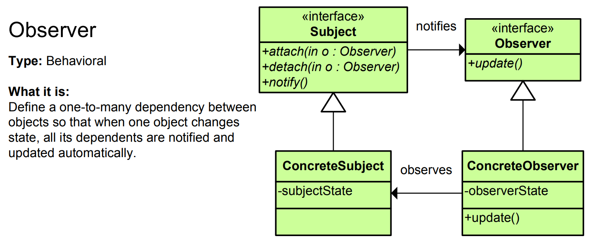

# Observer Pattern - Simple Explanation



## What Is It?

A pattern that **notifies multiple objects when something changes**.

Think: YouTube notifications. You subscribe to a channel. When new video drops, YouTube notifies all subscribers automatically. Subscribers don't poll (check), YouTube pushes (notifies).

---

## Real Example: Stock Price Alert

Without Observer (Bad):
```java
while (true) {
    // Keep checking stock price every second 💤
    double price = stockMarket.getPrice("APPLE");
    if (price < 150) {
        sendAlert("APPLE dropped below $150!");
    }
}
```

With Observer (Good):
```java
Stock apple = new Stock("APPLE", 150);
apple.attach(observer1);  // Subscribe
apple.attach(observer2);  // Subscribe

// When price drops, notify automatically
apple.setPrice(140);  // Notifies all observers!
```

---

## The Code

### 1. Observer Interface

```java
public interface Observer {
    void update(String stockName, double price);
}
```

### 2. Concrete Observers

```java
public class InvestorA implements Observer {
    private String name = "Investor A";
    
    @Override
    public void update(String stockName, double price) {
        System.out.println(name + " received alert: " + stockName + " is now $" + price);
    }
}

public class InvestorB implements Observer {
    private String name = "Investor B";
    
    @Override
    public void update(String stockName, double price) {
        System.out.println(name + " received alert: " + stockName + " is now $" + price);
    }
}

public class NewsAgency implements Observer {
    private String name = "News Agency";
    
    @Override
    public void update(String stockName, double price) {
        System.out.println(name + " publishing news: " + stockName + " price changed to $" + price);
    }
}
```

### 3. Subject (Notifies observers)

```java
import java.util.ArrayList;
import java.util.List;

public class Stock {
    private String name;
    private double price;
    private List<Observer> observers = new ArrayList<>();
    
    public Stock(String name, double initialPrice) {
        this.name = name;
        this.price = initialPrice;
    }
    
    // Subscribe
    public void attach(Observer observer) {
        observers.add(observer);
        System.out.println(observer + " subscribed");
    }
    
    // Unsubscribe
    public void detach(Observer observer) {
        observers.remove(observer);
    }
    
    // Notify all observers
    public void notifyObservers() {
        for (Observer observer : observers) {
            observer.update(name, price);
        }
    }
    
    // When price changes, notify everyone
    public void setPrice(double newPrice) {
        if (this.price != newPrice) {
            this.price = newPrice;
            notifyObservers();  // Push notification!
        }
    }
    
    public double getPrice() {
        return price;
    }
}
```

### 4. Use It

```java
public class App {
    public static void main(String[] args) {
        // Create stock
        Stock apple = new Stock("APPLE", 150);
        
        // Create observers (subscribers)
        InvestorA investorA = new InvestorA();
        InvestorB investorB = new InvestorB();
        NewsAgency news = new NewsAgency();
        
        // Subscribe to stock
        apple.attach(investorA);
        apple.attach(investorB);
        apple.attach(news);
        
        System.out.println("\n--- Price drops ---\n");
        
        // When price changes, automatically notify all!
        apple.setPrice(145);
        
        // Output:
        // InvestorA received alert: APPLE is now $145.0
        // InvestorB received alert: APPLE is now $145.0
        // News Agency publishing news: APPLE price changed to $145.0
        
        System.out.println("\n--- Another price change ---\n");
        apple.setPrice(140);
    }
}
```

---

## Visual

```
┌──────────────┐
│   Stock      │ (Subject/Observable)
│ - price      │
│ - observers  │
│ + setPrice() │
└──────┬───────┘
       │ notifies
   ┌───┴────┬──────────┬──────────┐
   │        │          │          │
   ▼        ▼          ▼          ▼
┌──────┐┌────────┐┌────────┐┌──────────┐
│Inv.A ││Inv.B   ││Inv.C   ││News      │ (Observers)
│update││update  ││update  ││update    │
└──────┘└────────┘└────────┘└──────────┘

When stock price changes:
Stock.setPrice(145)
  → notifyObservers()
    → Inv.A.update()
    → Inv.B.update()
    → Inv.C.update()
    → News.update()

All get notified automatically!
```

---

## Another Example: Weather Station

```java
// Observer
public interface WeatherObserver {
    void update(double temperature, double humidity, double pressure);
}

// Concrete observers
public class DisplayA implements WeatherObserver {
    @Override
    public void update(double temp, double humidity, double pressure) {
        System.out.println("Display A: Temp=" + temp + ", Humidity=" + humidity);
    }
}

public class DisplayB implements WeatherObserver {
    @Override
    public void update(double temp, double humidity, double pressure) {
        System.out.println("Display B: Pressure=" + pressure);
    }
}

public class PhoneApp implements WeatherObserver {
    @Override
    public void update(double temp, double humidity, double pressure) {
        System.out.println("Phone App: Update received! Temp=" + temp);
    }
}

// Subject
public class WeatherStation {
    private double temperature;
    private double humidity;
    private double pressure;
    private List<WeatherObserver> observers = new ArrayList<>();
    
    public void attach(WeatherObserver observer) {
        observers.add(observer);
    }
    
    public void notifyObservers() {
        for (WeatherObserver observer : observers) {
            observer.update(temperature, humidity, pressure);
        }
    }
    
    public void setWeatherData(double temp, double humidity, double pressure) {
        this.temperature = temp;
        this.humidity = humidity;
        this.pressure = pressure;
        notifyObservers();  // Alert all!
    }
}

// Usage
public class App {
    public static void main(String[] args) {
        WeatherStation station = new WeatherStation();
        
        DisplayA displayA = new DisplayA();
        DisplayB displayB = new DisplayB();
        PhoneApp phoneApp = new PhoneApp();
        
        station.attach(displayA);
        station.attach(displayB);
        station.attach(phoneApp);
        
        // Weather changes, all observers notified
        station.setWeatherData(25.5, 65.0, 1013.5);
        // Output:
        // Display A: Temp=25.5, Humidity=65.0
        // Display B: Pressure=1013.5
        // Phone App: Update received! Temp=25.5
    }
}
```

---

## Another Example: Button Click Event

```java
// Observer (Listener)
public interface ClickListener {
    void onClick();
}

// Button (Subject)
public class Button {
    private List<ClickListener> listeners = new ArrayList<>();
    
    public void addListener(ClickListener listener) {
        listeners.add(listener);
    }
    
    public void click() {
        System.out.println("Button clicked!");
        for (ClickListener listener : listeners) {
            listener.onClick();
        }
    }
}

// Concrete listeners
public class SaveHandler implements ClickListener {
    @Override
    public void onClick() {
        System.out.println("Saving file...");
    }
}

public class LogHandler implements ClickListener {
    @Override
    public void onClick() {
        System.out.println("Logging click event...");
    }
}

// Usage
public class App {
    public static void main(String[] args) {
        Button saveButton = new Button();
        
        saveButton.addListener(new SaveHandler());
        saveButton.addListener(new LogHandler());
        
        saveButton.click();
        // Output:
        // Button clicked!
        // Saving file...
        // Logging click event...
    }
}
```

---

## Observer Pattern in Java

Java has built-in support:

```java
import java.util.Observable;
import java.util.Observer;

// Subject
public class Data extends Observable {
    private int value = 0;
    
    public void setValue(int newValue) {
        this.value = newValue;
        setChanged();          // Mark as changed
        notifyObservers(value); // Notify all
    }
}

// Observer
public class ValueDisplay implements Observer {
    @Override
    public void update(Observable o, Object arg) {
        System.out.println("Value changed: " + arg);
    }
}

// Usage
Data data = new Data();
data.addObserver(new ValueDisplay());
data.setValue(42);  // Notifies observer!
```

---

## When to Use?

✅ One object changes, others need to know  
✅ Don't know how many objects will react  
✅ Event handling (clicks, user input)  
✅ Real-time updates (stocks, weather, scores)  
✅ Reactive programming

❌ Simple one-to-one relationships  
❌ Tight coupling is okay  
❌ Performance critical (many observers)

---

## Observer vs Similar Patterns

| Pattern | Purpose |
|---------|---------|
| **Observer** | Notify multiple objects of state change |
| **Mediator** | Centralize communication between objects |
| **Pub/Sub** | Decoupled event publishing (Observer with topics) |
| **Strategy** | Swap algorithms |

---

## Real-World Examples

- **Stock alerts** (price changes)
- **Social media** (followers get notifications)
- **News subscriptions** (subscribers get updates)
- **Event listeners** (click, hover, scroll)
- **MVC framework** (Model notifies Views)
- **Reactive libraries** (RxJava, Project Reactor)
- **Smart home** (sensor triggers actions)
- **Game events** (enemy dies, score updates)

---

## Key Benefit

**Loose coupling: Subject doesn't know observers, observers don't know each other!**

```
Subject: "I changed, notify whoever subscribed"
Observer: "I'll react if something changes"

They don't need to know each other!
```

---

## Push vs Pull

**Push (shown above):**
- Subject sends data to observers
- Observers receive without asking
- Used in examples above

**Pull:**
- Subject only notifies "something changed"
- Observers ask for data if needed
- Less coupling, but extra call

---

## Key Characteristics

✅ Loose coupling  
✅ Dynamic subscription  
✅ One-to-many relationship  
✅ Real-time updates  
✅ Push notification pattern

The Observer pattern is perfect for **event handling and notifications!** 🔔