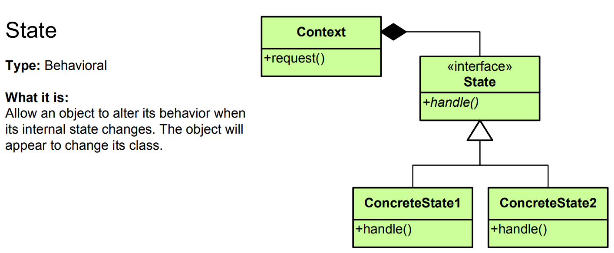

# State Pattern - Simple Explanation




## What Is It?

A pattern that **changes object behavior based on its internal state**.

Think: Music player. It behaves differently based on state:
- **Playing** state: pressing play does nothing, pressing pause stops music
- **Paused** state: pressing pause does nothing, pressing play resumes music
- **Stopped** state: pressing play starts from beginning

Same action (button press), different behavior (based on state)!

---

## Real Example: Traffic Light

States: Red → Green → Yellow → Red

```
RED light:
  - stop() → blocks cars
  - go() → does nothing

GREEN light:
  - stop() → does nothing
  - go() → lets cars pass

YELLOW light:
  - stop() → prepares to stop
  - go() → prepares to go
```

Same interface, different behavior per state!

---

## The Code

### 1. State Interface

```java
public interface TrafficLightState {
    void stop();
    void go();
}
```

### 2. Concrete States

```java
public class RedState implements TrafficLightState {
    @Override
    public void stop() {
        System.out.println("🔴 RED: STOP! Cars must wait.");
    }
    
    @Override
    public void go() {
        System.out.println("🔴 RED: Go button pressed but light is RED, ignoring...");
    }
}

public class GreenState implements TrafficLightState {
    @Override
    public void stop() {
        System.out.println("🟢 GREEN: Stop button pressed but light is GREEN, ignoring...");
    }
    
    @Override
    public void go() {
        System.out.println("🟢 GREEN: GO! Cars can pass.");
    }
}

public class YellowState implements TrafficLightState {
    @Override
    public void stop() {
        System.out.println("🟡 YELLOW: Prepare to stop...");
    }
    
    @Override
    public void go() {
        System.out.println("🟡 YELLOW: Prepare to go...");
    }
}
```

### 3. Context (Has state)

```java
public class TrafficLight {
    private TrafficLightState state;
    
    public TrafficLight() {
        this.state = new RedState();  // Initial state
    }
    
    // Change state
    public void setState(TrafficLightState state) {
        this.state = state;
    }
    
    // Delegate to current state
    public void stop() {
        state.stop();
    }
    
    public void go() {
        state.go();
    }
    
    // Cycle through states
    public void cycle() {
        if (state instanceof RedState) {
            setState(new GreenState());
        } else if (state instanceof GreenState) {
            setState(new YellowState());
        } else if (state instanceof YellowState) {
            setState(new RedState());
        }
    }
}
```

### 4. Use It

```java
public class App {
    public static void main(String[] args) {
        TrafficLight light = new TrafficLight();
        
        // RED state
        light.stop();   // 🔴 RED: STOP! Cars must wait.
        light.go();     // 🔴 RED: Go button pressed but light is RED, ignoring...
        
        System.out.println();
        
        // Change to GREEN
        light.cycle();
        light.stop();   // 🟢 GREEN: Stop button pressed but light is GREEN, ignoring...
        light.go();     // 🟢 GREEN: GO! Cars can pass.
        
        System.out.println();
        
        // Change to YELLOW
        light.cycle();
        light.stop();   // 🟡 YELLOW: Prepare to stop...
        light.go();     // 🟡 YELLOW: Prepare to go...
        
        System.out.println();
        
        // Back to RED
        light.cycle();
        light.stop();   // 🔴 RED: STOP! Cars must wait.
    }
}
```

---

## Visual

```
Without State Pattern (Bad):
┌────────────────────────────────┐
│   TrafficLight                 │
│ + stop() {                     │
│     if (state == RED)          │ ◄─── Messy if/else
│       // do this               │
│     else if (state == GREEN)   │
│       // do that               │
│     else if (state == YELLOW)  │
│       // do this               │
│   }                            │
└────────────────────────────────┘

With State Pattern (Good):
┌────────────────────────────────┐
│   TrafficLight                 │
│ + state: State                 │◄─── Delegates to state
│ + stop() {                     │
│     state.stop()               │
│   }                            │
└────────────────────────────────┘
         │ holds
         ▼
    ┌──────────┐
    │ State    │
    │ interface│
    └──────────┘
      │    │    │
      ▼    ▼    ▼
    ┌───┬───┬────────┐
    │Red│Green│Yellow│
    │   │     │      │
    └───┴───┴────────┘

Change state = change behavior!
```

---

## Another Example: Music Player

```java
// States
public interface PlayerState {
    void play();
    void pause();
    void stop();
}

public class PlayingState implements PlayerState {
    @Override
    public void play() {
        System.out.println("Already playing, ignoring...");
    }
    
    @Override
    public void pause() {
        System.out.println("⏸️ Pausing music");
    }
    
    @Override
    public void stop() {
        System.out.println("⏹️ Stopping music");
    }
}

public class PausedState implements PlayerState {
    @Override
    public void play() {
        System.out.println("▶️ Resuming music");
    }
    
    @Override
    public void pause() {
        System.out.println("Already paused, ignoring...");
    }
    
    @Override
    public void stop() {
        System.out.println("⏹️ Stopping music");
    }
}

public class StoppedState implements PlayerState {
    @Override
    public void play() {
        System.out.println("▶️ Starting music from beginning");
    }
    
    @Override
    public void pause() {
        System.out.println("Cannot pause, music is stopped");
    }
    
    @Override
    public void stop() {
        System.out.println("Already stopped, ignoring...");
    }
}

// Context
public class MusicPlayer {
    private PlayerState state;
    
    public MusicPlayer() {
        this.state = new StoppedState();
    }
    
    public void setState(PlayerState state) {
        this.state = state;
    }
    
    public void play() {
        state.play();
        if (state instanceof StoppedState || state instanceof PausedState) {
            setState(new PlayingState());
        }
    }
    
    public void pause() {
        state.pause();
        if (state instanceof PlayingState) {
            setState(new PausedState());
        }
    }
    
    public void stop() {
        state.stop();
        setState(new StoppedState());
    }
}

// Usage
public class App {
    public static void main(String[] args) {
        MusicPlayer player = new MusicPlayer();
        
        player.play();    // ▶️ Starting music from beginning
        player.pause();   // ⏸️ Pausing music
        player.play();    // ▶️ Resuming music
        player.stop();    // ⏹️ Stopping music
    }
}
```

---

## Another Example: Order Processing

```java
public interface OrderState {
    void pay();
    void ship();
    void deliver();
    void cancel();
}

public class PendingState implements OrderState {
    @Override
    public void pay() {
        System.out.println("💳 Payment processing...");
        // Change to Paid state
    }
    
    @Override
    public void ship() {
        System.out.println("Cannot ship unpaid order!");
    }
    
    @Override
    public void deliver() {
        System.out.println("Cannot deliver unpaid order!");
    }
    
    @Override
    public void cancel() {
        System.out.println("❌ Order cancelled");
    }
}

public class PaidState implements OrderState {
    @Override
    public void pay() {
        System.out.println("Already paid!");
    }
    
    @Override
    public void ship() {
        System.out.println("📦 Shipping order...");
        // Change to Shipped state
    }
    
    @Override
    public void deliver() {
        System.out.println("Cannot deliver, not shipped yet!");
    }
    
    @Override
    public void cancel() {
        System.out.println("❌ Cannot cancel, already paid!");
    }
}

public class ShippedState implements OrderState {
    @Override
    public void pay() {
        System.out.println("Already paid!");
    }
    
    @Override
    public void ship() {
        System.out.println("Already shipped!");
    }
    
    @Override
    public void deliver() {
        System.out.println("🚚 Delivering order...");
        // Change to Delivered state
    }
    
    @Override
    public void cancel() {
        System.out.println("❌ Cannot cancel, already shipped!");
    }
}

public class Order {
    private OrderState state;
    
    public Order() {
        this.state = new PendingState();
    }
    
    public void setState(OrderState state) {
        this.state = state;
    }
    
    public void pay() {
        state.pay();
    }
    
    public void ship() {
        state.ship();
    }
    
    public void deliver() {
        state.deliver();
    }
    
    public void cancel() {
        state.cancel();
    }
}
```

---

## When to Use?

✅ Object behavior depends on state  
✅ State changes during runtime  
✅ Large conditional (if/else) statements  
✅ Same action, different behavior per state  
✅ State transitions are clear

❌ Few states or simple behavior  
❌ State never changes  
❌ Strategy pattern is better (if no state transitions)

---

## State vs Similar Patterns

| Pattern | Purpose |
|---------|---------|
| **State** | Change behavior based on internal state |
| **Strategy** | Pick different algorithms |
| **Template Method** | Define algorithm skeleton |
| **Command** | Encapsulate request |

---

## Key Difference: State vs Strategy

```
STATE:
- State changes during object lifetime
- Context changes state automatically
- Multiple states, automatic transitions
- Example: Traffic light (RED → GREEN → YELLOW)

STRATEGY:
- Client picks algorithm/strategy
- Doesn't change automatically
- Independent algorithms
- Example: Sorting (pick QuickSort, MergeSort)
```

---

## Real-World Examples

- **Traffic light** (red → green → yellow)
- **Music player** (playing → paused → stopped)
- **Order processing** (pending → paid → shipped → delivered)
- **Document workflow** (draft → review → approved → published)
- **TCP connection** (established → closed)
- **Game character** (idle → running → jumping → falling)
- **ATM machine** (idle → authentication → transaction)
- **Elevator** (idle → moving up → moving down)

---

## Key Benefit

**Encapsulate state logic, avoid messy if/else chains, clear state transitions!**

```
Without State Pattern:
public void action() {
    if (state == RED) {
        // 10 lines for RED behavior
    } else if (state == GREEN) {
        // 10 lines for GREEN behavior
    } else if (state == YELLOW) {
        // 10 lines for YELLOW behavior
    }
}
// Messy, hard to maintain!

With State Pattern:
public void action() {
    state.action();  // Delegates to state
}
// Clean! Each state has its own class!
```

---

## Key Characteristics

✅ State-specific behavior  
✅ Easy to add new states  
✅ Clear state transitions  
✅ Avoids if/else explosion  
✅ Single Responsibility Principle  
✅ Open/Closed Principle

The State pattern is perfect for **objects with multiple states and clear transitions!** 🔄