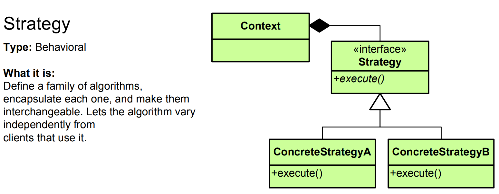

# Strategy Pattern - Simple Explanation




## What Is It?

A pattern that **defines multiple algorithms and lets you swap them at runtime**.

Think: Navigation app. You can choose different strategies: drive (fastest route), bike (safe route), walk (scenic route). Same app, different strategies.

---

## Real Example: Payment Methods

Without Strategy:
```java
if (paymentType == "credit") {
    // Process credit card
} else if (paymentType == "paypal") {
    // Process PayPal
} else if (paymentType == "bitcoin") {
    // Process Bitcoin
}
// Add new method = modify this class (bad!)
```

With Strategy:
```java
PaymentStrategy strategy = new CreditCardPayment();
order.pay(strategy);  // Or swap strategy anytime!

strategy = new PayPalPayment();
order.pay(strategy);  // Different algorithm, same code
```

---

## The Code

### 1. Strategy Interface

```java
public interface PaymentStrategy {
    void pay(double amount);
}
```

### 2. Concrete Strategies

```java
public class CreditCardPayment implements PaymentStrategy {
    private String cardNumber;
    
    public CreditCardPayment(String cardNumber) {
        this.cardNumber = cardNumber;
    }
    
    @Override
    public void pay(double amount) {
        System.out.println("Paying $" + amount + " with credit card: " + cardNumber);
        System.out.println("Processing credit card...");
    }
}

public class PayPalPayment implements PaymentStrategy {
    private String email;
    
    public PayPalPayment(String email) {
        this.email = email;
    }
    
    @Override
    public void pay(double amount) {
        System.out.println("Paying $" + amount + " with PayPal: " + email);
        System.out.println("Redirecting to PayPal...");
    }
}

public class BitcoinPayment implements PaymentStrategy {
    private String walletAddress;
    
    public BitcoinPayment(String walletAddress) {
        this.walletAddress = walletAddress;
    }
    
    @Override
    public void pay(double amount) {
        System.out.println("Paying $" + amount + " Bitcoin to: " + walletAddress);
        System.out.println("Processing blockchain...");
    }
}
```

### 3. Context (Uses strategy)

```java
public class Order {
    private double total;
    private PaymentStrategy paymentStrategy;
    
    public Order(double total) {
        this.total = total;
    }
    
    // Set strategy at runtime
    public void setPaymentStrategy(PaymentStrategy strategy) {
        this.paymentStrategy = strategy;
    }
    
    // Execute strategy
    public void checkout() {
        if (paymentStrategy == null) {
            System.out.println("Select a payment method!");
            return;
        }
        paymentStrategy.pay(total);
    }
}
```

### 4. Use It

```java
public class App {
    public static void main(String[] args) {
        Order order = new Order(99.99);
        
        // Customer chooses credit card
        order.setPaymentStrategy(new CreditCardPayment("1234-5678-9012-3456"));
        order.checkout();
        // Output: Paying $99.99 with credit card: 1234-5678-9012-3456
        //         Processing credit card...
        
        System.out.println();
        
        // Change mind, use PayPal instead
        order.setPaymentStrategy(new PayPalPayment("user@email.com"));
        order.checkout();
        // Output: Paying $99.99 with PayPal: user@email.com
        //         Redirecting to PayPal...
        
        System.out.println();
        
        // Now use Bitcoin
        order.setPaymentStrategy(new BitcoinPayment("1A1z7agoat..."));
        order.checkout();
        // Output: Paying $99.99 Bitcoin to: 1A1z7agoat...
        //         Processing blockchain...
    }
}
```

---

## Visual

```
┌──────────────────────────┐
│      Order (Context)     │
│ - total                  │
│ - paymentStrategy        │◄─── Changes at runtime!
│ + checkout()             │
└──────────────────────────┘
         │ uses
         ▼
┌──────────────────────────┐
│  PaymentStrategy (i/f)   │
│  + pay()                 │
└──────────────────────────┘
      │         │         │
      ▼         ▼         ▼
┌───────────┐┌───────┐┌──────────┐
│ CreditCard││PayPal ││Bitcoin   │
│ Strategy  ││       ││          │
└───────────┘└───────┘└──────────┘

Pick any strategy at runtime!
```

---

## Another Example: Sorting

```java
// Strategy interface
public interface SortingStrategy {
    void sort(int[] arr);
}

// Concrete strategies
public class QuickSort implements SortingStrategy {
    @Override
    public void sort(int[] arr) {
        System.out.println("Sorting with QuickSort (fast)");
        // QuickSort algorithm
    }
}

public class MergeSort implements SortingStrategy {
    @Override
    public void sort(int[] arr) {
        System.out.println("Sorting with MergeSort (stable)");
        // MergeSort algorithm
    }
}

public class BubbleSort implements SortingStrategy {
    @Override
    public void sort(int[] arr) {
        System.out.println("Sorting with BubbleSort (simple)");
        // BubbleSort algorithm
    }
}

// Context
public class DataProcessor {
    private SortingStrategy strategy;
    
    public void setStrategy(SortingStrategy strategy) {
        this.strategy = strategy;
    }
    
    public void processData(int[] data) {
        strategy.sort(data);
    }
}

// Usage
public class App {
    public static void main(String[] args) {
        DataProcessor processor = new DataProcessor();
        int[] data = {5, 2, 8, 1, 9};
        
        // Use QuickSort
        processor.setStrategy(new QuickSort());
        processor.processData(data);
        
        // Switch to MergeSort
        processor.setStrategy(new MergeSort());
        processor.processData(data);
        
        // Switch to BubbleSort
        processor.setStrategy(new BubbleSort());
        processor.processData(data);
    }
}
```

---

## Another Example: Discount Strategies

```java
public interface DiscountStrategy {
    double applyDiscount(double price);
}

public class NoDiscount implements DiscountStrategy {
    @Override
    public double applyDiscount(double price) {
        return price;
    }
}

public class PercentageDiscount implements DiscountStrategy {
    private double percent;
    
    public PercentageDiscount(double percent) {
        this.percent = percent;
    }
    
    @Override
    public double applyDiscount(double price) {
        return price * (1 - percent / 100);
    }
}

public class FlatDiscount implements DiscountStrategy {
    private double amount;
    
    public FlatDiscount(double amount) {
        this.amount = amount;
    }
    
    @Override
    public double applyDiscount(double price) {
        return Math.max(0, price - amount);
    }
}

// Context
public class ShoppingCart {
    private double total;
    private DiscountStrategy discount = new NoDiscount();
    
    public void setDiscount(DiscountStrategy discount) {
        this.discount = discount;
    }
    
    public double getTotal() {
        return discount.applyDiscount(total);
    }
}
```

---

## When to Use?

✅ Many similar algorithms with different behavior  
✅ Need to switch algorithms at runtime  
✅ Want to avoid lots of if/else conditions  
✅ Each algorithm should be in its own class  
✅ Open/Closed Principle (open for extension, closed for modification)

❌ Only one algorithm  
❌ Algorithms rarely change  
❌ Simple conditions are clearer

---

## Strategy vs Similar Patterns

| Pattern | Purpose |
|---------|---------|
| **Strategy** | Swap algorithms at runtime |
| **State** | Change behavior based on state |
| **Command** | Encapsulate a request/action |
| **Factory** | Create objects |

---

## Real-World Examples

- **Navigation apps** (drive, bike, walk routes)
- **Payment systems** (credit card, PayPal, crypto)
- **Sorting** (QuickSort, MergeSort, BubbleSort)
- **Compression** (ZIP, RAR, 7Z)
- **Rendering** (PDF, Word, HTML export)
- **Authentication** (OAuth, JWT, Basic Auth)
- **Caching** (LRU, LFU, FIFO)
- **Search algorithms** (BFS, DFS, A*)

---

## Key Benefit

**Pick the right algorithm for the job, swap anytime, no if/else mess!**

```java
// Without Strategy (ugly)
if (algorithm == "quick") {
    quickSort(data);
} else if (algorithm == "merge") {
    mergeSort(data);
} else if (algorithm == "bubble") {
    bubbleSort(data);
}
// Add new? Modify this code!

// With Strategy (clean)
processor.setStrategy(new QuickSort());
processor.sort(data);
// Add new? Just create new class!
```

---

## Pattern Comparison

```
Strategy:  Multiple algorithms, pick one
State:     Change behavior based on state
Command:   Package action to execute later
Template:  Define skeleton, subclasses fill details
```

Strategy is about **algorithm selection!** 🎯