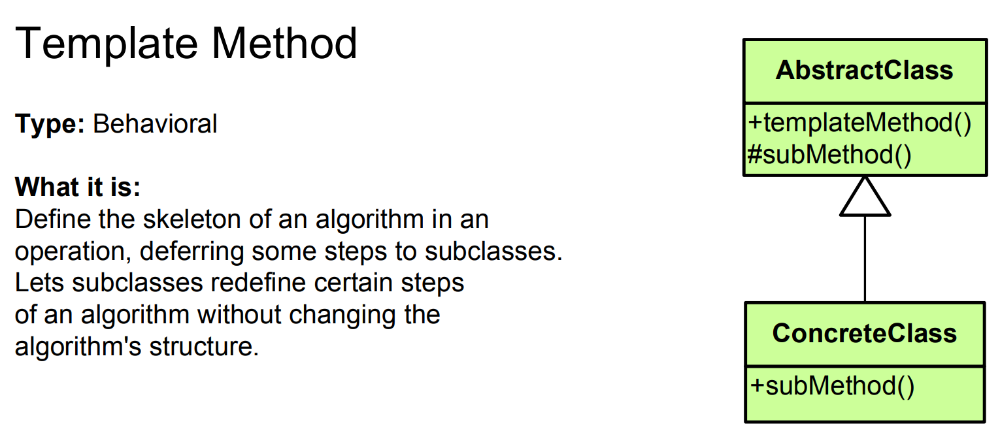

# Template Method Pattern - Simple Explanation




## What Is It?

A pattern that **defines the structure of an algorithm in a base class** but lets subclasses **customize specific steps**.

Think: Recipe. The steps are always the same (prep → cook → plate), but each recipe changes the ingredients and timing.

---

## Real Example: Making Beverages

All beverages follow same process:
1. Boil water
2. Brew ingredient
3. Pour into cup
4. Add condiments

But they differ in step 2 & 4!

```
Coffee:     Boil → Brew COFFEE → Pour → Add SUGAR & MILK
Tea:        Boil → Brew TEA → Pour → Add LEMON
Chocolate:  Boil → Brew CHOCOLATE → Pour → Add MARSHMALLOWS
```

Same skeleton, different details!

---

## The Code

### 1. Template Method in Base Class

```java
public abstract class Beverage {
    
    // Template method - defines skeleton
    public final void makeBeverage() {
        boilWater();
        brew();          // Different for each beverage
        pourInCup();
        addCondiments(); // Different for each beverage
    }
    
    // Common steps (same for all)
    private void boilWater() {
        System.out.println("Boiling water...");
    }
    
    private void pourInCup() {
        System.out.println("Pouring into cup...");
    }
    
    // Abstract steps (to be implemented by subclasses)
    protected abstract void brew();
    protected abstract void addCondiments();
}
```

### 2. Concrete Implementations

```java
public class Coffee extends Beverage {
    @Override
    protected void brew() {
        System.out.println("Brewing coffee grounds...");
    }
    
    @Override
    protected void addCondiments() {
        System.out.println("Adding sugar and milk...");
    }
}

public class Tea extends Beverage {
    @Override
    protected void brew() {
        System.out.println("Steeping tea bag...");
    }
    
    @Override
    protected void addCondiments() {
        System.out.println("Adding lemon...");
    }
}

public class HotChocolate extends Beverage {
    @Override
    protected void brew() {
        System.out.println("Mixing chocolate powder...");
    }
    
    @Override
    protected void addCondiments() {
        System.out.println("Adding marshmallows...");
    }
}
```

### 3. Use It

```java
public class App {
    public static void main(String[] args) {
        Beverage coffee = new Coffee();
        System.out.println("Making coffee...");
        coffee.makeBeverage();
        // Output:
        // Making coffee...
        // Boiling water...
        // Brewing coffee grounds...
        // Pouring into cup...
        // Adding sugar and milk...
        
        System.out.println("\n");
        
        Beverage tea = new Tea();
        System.out.println("Making tea...");
        tea.makeBeverage();
        // Output:
        // Making tea...
        // Boiling water...
        // Steeping tea bag...
        // Pouring into cup...
        // Adding lemon...
        
        System.out.println("\n");
        
        Beverage chocolate = new HotChocolate();
        System.out.println("Making hot chocolate...");
        chocolate.makeBeverage();
        // Output:
        // Making hot chocolate...
        // Boiling water...
        // Mixing chocolate powder...
        // Pouring into cup...
        // Adding marshmallows...
    }
}
```

---

## Visual

```
┌────────────────────────────────────┐
│  Beverage (Base Class)             │
│                                    │
│  makeBeverage() {                  │◄─── Template Method
│    boilWater();      ──┐           │     (Defines skeleton)
│    brew();           ──┤ Fixed     │
│    pourInCup();      ──┤ steps     │
│    addCondiments();  ──┘           │
│  }                                 │
│                                    │
│  + brew() - abstract               │
│  + addCondiments() - abstract      │
└────────────────────────────────────┘
         ▲           ▲           ▲
         │           │           │
         │           │           │
   ┌─────┴────┐ ┌────┴────┐ ┌───┴─────────┐
   │  Coffee  │ │   Tea   │ │HotChocolate │
   │ - brew() │ │-brew()  │ │ - brew()    │
   │ - add()  │ │- add()  │ │ - add()     │
   └──────────┘ └─────────┘ └─────────────┘
   (Customize  (Customize  (Customize
    specific    specific    specific
    steps)      steps)      steps)
```

---

## Another Example: Data Processing

```java
// Template method defines process
public abstract class DataProcessor {
    
    public final void process() {
        readData();
        validateData();  // Different for each processor
        transformData(); // Different for each processor
        saveData();
    }
    
    protected void readData() {
        System.out.println("Reading data...");
    }
    
    protected void saveData() {
        System.out.println("Saving data...");
    }
    
    // Steps that vary
    protected abstract void validateData();
    protected abstract void transformData();
}

// CSV processor
public class CSVProcessor extends DataProcessor {
    @Override
    protected void validateData() {
        System.out.println("Validating CSV format...");
    }
    
    @Override
    protected void transformData() {
        System.out.println("Converting CSV to objects...");
    }
}

// JSON processor
public class JSONProcessor extends DataProcessor {
    @Override
    protected void validateData() {
        System.out.println("Validating JSON syntax...");
    }
    
    @Override
    protected void transformData() {
        System.out.println("Parsing JSON to objects...");
    }
}

// XML processor
public class XMLProcessor extends DataProcessor {
    @Override
    protected void validateData() {
        System.out.println("Validating XML schema...");
    }
    
    @Override
    protected void transformData() {
        System.out.println("Parsing XML to objects...");
    }
}

// Usage
public class App {
    public static void main(String[] args) {
        DataProcessor csv = new CSVProcessor();
        csv.process();
        
        DataProcessor json = new JSONProcessor();
        json.process();
        
        DataProcessor xml = new XMLProcessor();
        xml.process();
    }
}
```

---

## Another Example: Game AI

```java
public abstract class GameAI {
    
    // Template method
    public final void executeTurn() {
        analyzeEnvironment();
        planStrategy();      // Different for each AI
        executeActions();    // Different for each AI
        evaluateResult();
    }
    
    protected void analyzeEnvironment() {
        System.out.println("Analyzing board...");
    }
    
    protected void evaluateResult() {
        System.out.println("Checking win conditions...");
    }
    
    protected abstract void planStrategy();
    protected abstract void executeActions();
}

public class AggressiveAI extends GameAI {
    @Override
    protected void planStrategy() {
        System.out.println("Planning aggressive attack...");
    }
    
    @Override
    protected void executeActions() {
        System.out.println("Attacking enemy...");
    }
}

public class DefensiveAI extends GameAI {
    @Override
    protected void planStrategy() {
        System.out.println("Planning defensive position...");
    }
    
    @Override
    protected void executeActions() {
        System.out.println("Building defenses...");
    }
}

public class SmartAI extends GameAI {
    @Override
    protected void planStrategy() {
        System.out.println("Analyzing opponent weaknesses...");
    }
    
    @Override
    protected void executeActions() {
        System.out.println("Executing optimal move...");
    }
}
```

---

## When to Use?

✅ Multiple classes with same algorithm structure  
✅ Only specific steps differ  
✅ Want to avoid code duplication  
✅ Share common logic in base class  
✅ Control subclass behavior (template method is final)

❌ Algorithm structure changes frequently  
❌ Only one implementation  
❌ Steps are completely different

---

## Template Method vs Similar Patterns

| Pattern | Purpose |
|---------|---------|
| **Template Method** | Define algorithm skeleton in base, customize steps |
| **Strategy** | Pick different algorithms at runtime |
| **State** | Change behavior based on state |
| **Factory** | Create objects |

---

## Key Differences

```
Template Method:
- Inheritance-based
- Algorithm structure fixed
- Base class controls flow
- Subclasses fill in details

Strategy:
- Composition-based
- Algorithm can change at runtime
- Client controls selection
- Strategies are independent
```

---

## Real-World Examples

- **Database queries** (SELECT, INSERT structure varies)
- **File parsers** (read, parse, save structure varies)
- **Build process** (compile, test, deploy structure varies)
- **Web frameworks** (request → process → response)
- **Game development** (init, update, render)
- **Document generators** (header, body, footer)
- **UI components** (layout, render, paint)
- **JUnit test cases** (setUp → test → tearDown)

---

## Java Built-in Example

**JUnit** uses Template Method:

```java
public class MyTest {
    @Before
    public void setUp() {
        // Your setup
    }
    
    @Test
    public void testSomething() {
        // Your test
    }
    
    @After
    public void tearDown() {
        // Your cleanup
    }
    
    // JUnit framework:
    // setUp() → testSomething() → tearDown()
    // You customize setUp/tearDown, JUnit controls flow!
}
```

---

## Key Benefit

**Define once, customize many times. No code duplication!**

```
All beverages:
1. Boil water (SAME)
2. Brew (DIFFERENT)
3. Pour (SAME)
4. Add condiments (DIFFERENT)

Without Template Method:
Coffee has boilWater() + brew() + pour() + addCondiments()
Tea has boilWater() + brew() + pour() + addCondiments()
(Duplicate code!)

With Template Method:
Beverage defines full flow
Coffee/Tea only override brew() & addCondiments()
(DRY principle!)
```

---

## Key Characteristics

✅ Defines algorithm skeleton in base class  
✅ Subclasses implement specific steps  
✅ Base class controls overall flow  
✅ Template method marked as `final`  
✅ Uses inheritance, not composition  
✅ Great for avoiding code duplication

The Template Method pattern is perfect for **shared algorithm structures!** 📋