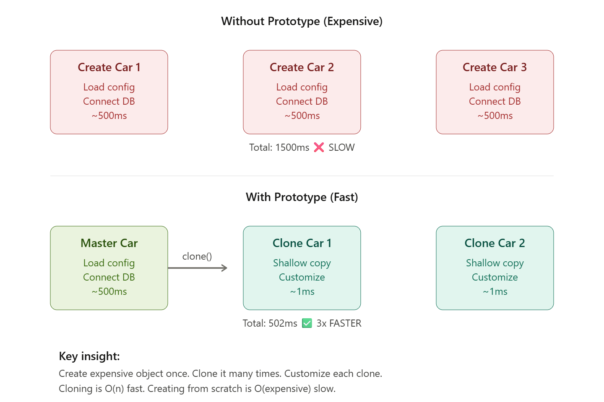

### `NOTE: Prototype pattern is a little bit tricky, so it needs a whole explanation file.`

## PROTOTYPE PATTERN — The Clone Master
> Specify the kinds of objects to create using a prototypical instance, and create new objects by copying this prototype.

### 📖 Why It Exists
> The key insight: We're trading creation cost for cloning cost. Cloning is exponentially faster than construction.

### ⚙️ How It Works
1. Create a "master" or "template" object
   - [x] Expensive initialization happens ONCE

2. Object implements Cloneable interface
   - Java requires this to use clone()

3. Override clone() method
   - Return a copy of the object

4. Client clones the master as needed
   - Each clone is a separate object
   - Can be customized independently
   - Original master remains unchanged

5. Two types of cloning:
   - Shallow copy: copies references, not objects
        - Fast, but shared mutable fields are dangerous
   - Deep copy: copies everything recursively 
     - Slower, but completely independent

### ⚙️ Why we use it

- When object creation is `expensive` (CPU/memory heavy)
- When we want to avoid complex construction logic
- When the system should be independent of how objects are created
- When objects are similar but slightly modified
- When we want to reduce number of subclasses

### ⚠️ Important Concept: Shallow vs Deep Copy
1. Shallow copy

> Copies references → same memory objects shared

2. Deep copy

> Copies everything → completely independent object

👉 Prototype pattern often requires `deep cloning` for safety.

### Note:

>super.clone() → performs shallow copy only
Deep copy must be implemented `manually`.
 
``See package shaleep, to profound your knowledge in shallow copy vs deep copy``