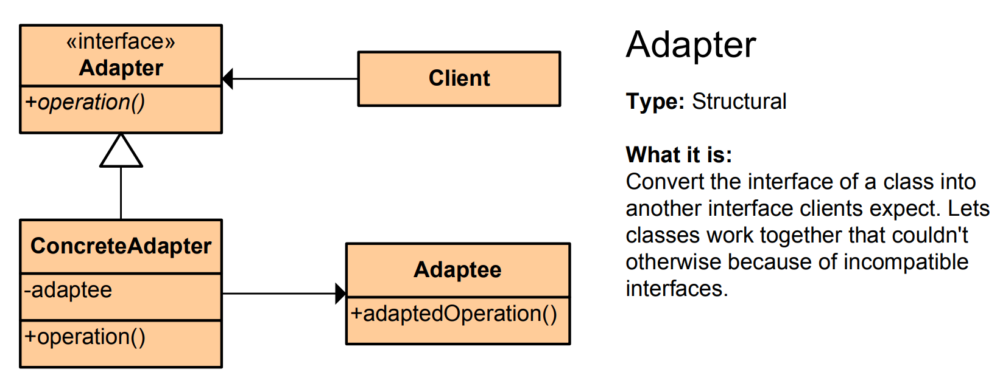

# Adapter Pattern - Simple Explanation



## What Is It?

A pattern that makes **incompatible objects work together** by converting one interface to another.

Think: A USB-C phone and an old USB charger. You use an adapter to make them compatible.

---

## Real Example: Payment System

You have code that expects a `PaymentProcessor`:

```java
public interface PaymentProcessor {
    void pay(double amount);
}
```

But you have an **old third-party library** with a different interface:

```java
public class OldPaymentGateway {
    public void processPayment(double money) {
        System.out.println("Payment of $" + money + " processed");
    }
}
```

**Problem:** `OldPaymentGateway` doesn't match `PaymentProcessor`. You can't use it directly.

**Solution:** Create an **Adapter** that bridges them.

---

## The Code

### 1. Target Interface (What we want)
```java
public interface PaymentProcessor {
    void pay(double amount);
}
```

### 2. Adaptee (Old, incompatible class)
```java
public class OldPaymentGateway {
    public void processPayment(double money) {
        System.out.println("Payment of $" + money + " processed");
    }
}
```

### 3. Adapter (The bridge)
```java
public class PaymentAdapter implements PaymentProcessor {
    private OldPaymentGateway oldGateway;
    
    public PaymentAdapter(OldPaymentGateway oldGateway) {
        this.oldGateway = oldGateway;
    }
    
    @Override
    public void pay(double amount) {
        // Convert new interface to old one
        oldGateway.processPayment(amount);
    }
}
```

### 4. Use It
```java
public class App {
    public static void main(String[] args) {
        // Old gateway with wrong interface
        OldPaymentGateway oldGateway = new OldPaymentGateway();
        
        // Wrap it with adapter
        PaymentProcessor processor = new PaymentAdapter(oldGateway);
        
        // Now it works!
        processor.pay(100.0);  // Output: Payment of $100.0 processed
    }
}
```

---

## Visual

```
┌────────────────────────┐
│  Your Code (expects    │
│  PaymentProcessor)     │
└───────────┬────────────┘
            │
            ▼
┌────────────────────────┐
│   PaymentAdapter       │ ◄─── Converts interface
│   (implements          │
│   PaymentProcessor)    │
└───────────┬────────────┘
            │
            ▼
┌────────────────────────┐
│ OldPaymentGateway      │
│ (Different interface)  │
└────────────────────────┘
```

---

## Another Example: Different Data Formats

```java
// You have code expecting JSON
public interface JsonFormatter {
    String toJson();
}

// But you have an old XML converter
public class XMLConverter {
    public String toXml() {
        return "<data>value</data>";
    }
}

// Adapter converts XML to JSON
public class XmlToJsonAdapter implements JsonFormatter {
    private XMLConverter xmlConverter;
    
    public XmlToJsonAdapter(XMLConverter xmlConverter) {
        this.xmlConverter = xmlConverter;
    }
    
    @Override
    public String toJson() {
        String xml = xmlConverter.toXml();
        // Convert XML to JSON
        return "{\"data\":\"value\"}";
    }
}
```

---

## When to Use?

✅ Integrating old code with new code  
✅ Using third-party libraries with incompatible interfaces  
✅ Making different systems work together  
✅ Avoiding changes to working code

❌ Can make code harder to read  
❌ Too many adapters = confusing architecture

---

## Real-World Examples

- **USB adapters** (USB-C to USB-A)
- **Database drivers** (different databases, same interface)
- **API wrappers** (old API, new client)
- **Legacy system integration** (old code + new system)
- **Streaming adapters** (InputStreamReader converts bytes to characters)

---

## Key Benefit

**Reuse old code without changing it—just wrap it with an adapter!**

No modifications needed to the old class.

