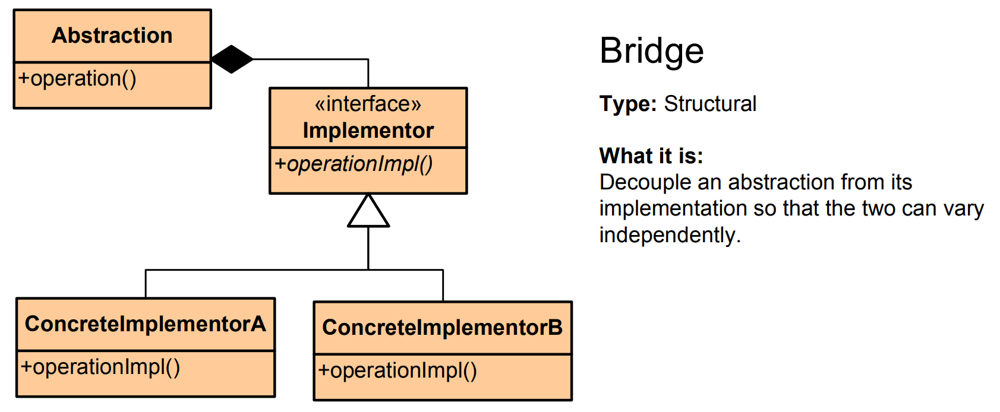

# Bridge Pattern - Simple Explanation




## What Is It?

A pattern that **separates abstraction from implementation** so they can vary independently.

Think: A TV remote (abstraction) and TV types (implementation). The remote works the same way whether you have a Sony TV, Samsung TV, or LG TV. The remote is a "bridge" between you and different TV implementations.

---

## Problem It Solves

Imagine you have shapes (Circle, Square) and colors (Red, Blue).

**Without Bridge (Bad):**
```
RedCircle
BlueCircle
RedSquare
BlueSquare
```
That's 4 classes for just 2 shapes × 2 colors. With 10 shapes and 10 colors = 100 classes! 💥

**With Bridge (Good):**
```
Shape (interface)
  └─ Circle, Square
Color (interface)
  └─ Red, Blue
```
Bridge connects them = 12 classes total, and you can mix any shape with any color!

---

## The Code

### 1. Implementation Interface (What varies)

```java
public interface Color {
    void apply();
}
```

### 2. Concrete Implementations

```java
public class RedColor implements Color {
    @Override
    public void apply() {
        System.out.println("Applying red color");
    }
}

public class BlueColor implements Color {
    @Override
    public void apply() {
        System.out.println("Applying blue color");
    }
}

public class GreenColor implements Color {
    @Override
    public void apply() {
        System.out.println("Applying green color");
    }
}
```

### 3. Abstraction (Uses implementation)

```java
public abstract class Shape {
    protected Color color;  // Bridge to color implementation
    
    public Shape(Color color) {
        this.color = color;
    }
    
    abstract void draw();
}
```

### 4. Concrete Abstractions

```java
public class Circle extends Shape {
    public Circle(Color color) {
        super(color);
    }
    
    @Override
    void draw() {
        System.out.print("Drawing Circle: ");
        color.apply();
    }
}

public class Square extends Shape {
    public Square(Color color) {
        super(color);
    }
    
    @Override
    void draw() {
        System.out.print("Drawing Square: ");
        color.apply();
    }
}

public class Triangle extends Shape {
    public Triangle(Color color) {
        super(color);
    }
    
    @Override
    void draw() {
        System.out.print("Drawing Triangle: ");
        color.apply();
    }
}
```

### 5. Use It

```java
public class App {
    public static void main(String[] args) {
        // Create colors
        Color red = new RedColor();
        Color blue = new BlueColor();
        Color green = new GreenColor();
        
        // Bridge shapes with colors
        Shape redCircle = new Circle(red);
        Shape blueSquare = new Square(blue);
        Shape greenTriangle = new Triangle(green);
        
        // Mix and match any shape with any color!
        redCircle.draw();          // Drawing Circle: Applying red color
        blueSquare.draw();         // Drawing Square: Applying blue color
        greenTriangle.draw();      // Drawing Triangle: Applying green color
        
        // Easy to swap colors
        Shape redSquare = new Square(red);
        redSquare.draw();          // Drawing Square: Applying red color
    }
}
```

---

## Visual

```
WITHOUT BRIDGE (Class explosion):
┌──────────┬──────────┬───────────┐
│RedCircle │BlueCircle│GreenCircle│
├──────────┼──────────┼───────────┤
│RedSquare │BlueSquare│GreenSquare│
├──────────┼──────────┼───────────┤
│RedTriange│BlueTriangle│GreenTriangle│
└──────────┴──────────┴───────────┘
        9 classes!

WITH BRIDGE (Clean separation):
        ┌─────────────────────┐
        │   Shape (Abstract)  │
        │ - color (bridge)    │
        └────────┬────────────┘
                 │ "is a"
         ┌───────┼───────┐
         │       │       │
      Circle  Square  Triangle  (3 shapes)
         │       │       │
         └───────┼───────┘
                 │ uses
            ┌────────────┐
            │Color Impl. │
            └────────────┘
                 │ "is a"
         ┌───────┼───────┐
         │       │       │
        Red    Blue   Green  (3 colors)

Total: 3 + 3 = 6 classes (vs 9 before!)
Mix and match = 3 × 3 combinations
```

---

## Another Example: Device & Remote

```java
// Implementation
public interface Device {
    void turnOn();
    void turnOff();
    void setVolume(int volume);
}

// Concrete implementations
public class TV implements Device {
    @Override
    public void turnOn() {
        System.out.println("TV is on");
    }
    
    @Override
    public void turnOff() {
        System.out.println("TV is off");
    }
    
    @Override
    public void setVolume(int volume) {
        System.out.println("TV volume: " + volume);
    }
}

public class Radio implements Device {
    @Override
    public void turnOn() {
        System.out.println("Radio is on");
    }
    
    @Override
    public void turnOff() {
        System.out.println("Radio is off");
    }
    
    @Override
    public void setVolume(int volume) {
        System.out.println("Radio volume: " + volume);
    }
}

// Abstraction (Remote)
public abstract class Remote {
    protected Device device;  // Bridge!
    
    public Remote(Device device) {
        this.device = device;
    }
    
    public void turnOn() {
        device.turnOn();
    }
    
    public void turnOff() {
        device.turnOff();
    }
}

// Concrete abstractions
public class BasicRemote extends Remote {
    public BasicRemote(Device device) {
        super(device);
    }
    
    public void volumeUp() {
        System.out.println("Volume Up");
        device.setVolume(10);
    }
}

public class SmartRemote extends Remote {
    public SmartRemote(Device device) {
        super(device);
    }
    
    public void volumeUp() {
        System.out.println("Volume Up");
        device.setVolume(10);
    }
    
    public void volumeDown() {
        System.out.println("Volume Down");
        device.setVolume(5);
    }
    
    public void voiceControl(String command) {
        System.out.println("Voice: " + command);
    }
}

// Usage
public class App {
    public static void main(String[] args) {
        Device tv = new TV();
        Device radio = new Radio();
        
        // Same remote works with different devices!
        Remote basicTV = new BasicRemote(tv);
        Remote smartRadio = new SmartRemote(radio);
        
        basicTV.turnOn();        // TV is on
        basicTV.volumeUp();      // Volume Up + TV volume: 10
        
        smartRadio.voiceControl("Play Jazz");  // Voice: Play Jazz
    }
}
```

---

## Another Example: Database Abstraction

```java
// Implementation
public interface DatabaseImplementation {
    void connect();
    void query(String sql);
    void disconnect();
}

// Concrete implementations
public class MySQLImpl implements DatabaseImplementation {
    public void connect() { System.out.println("MySQL connected"); }
    public void query(String sql) { System.out.println("MySQL query: " + sql); }
    public void disconnect() { System.out.println("MySQL disconnected"); }
}

public class PostgreSQLImpl implements DatabaseImplementation {
    public void connect() { System.out.println("PostgreSQL connected"); }
    public void query(String sql) { System.out.println("PostgreSQL query: " + sql); }
    public void disconnect() { System.out.println("PostgreSQL disconnected"); }
}

// Abstraction
public abstract class Database {
    protected DatabaseImplementation impl;
    
    public Database(DatabaseImplementation impl) {
        this.impl = impl;
    }
    
    public void open() {
        impl.connect();
    }
    
    public void close() {
        impl.disconnect();
    }
    
    abstract void execute(String sql);
}

// Concrete abstractions
public class ApplicationDB extends Database {
    public ApplicationDB(DatabaseImplementation impl) {
        super(impl);
    }
    
    @Override
    void execute(String sql) {
        impl.query(sql);
    }
}

// Usage
public class App {
    public static void main(String[] args) {
        // Switch between MySQL and PostgreSQL easily!
        Database db1 = new ApplicationDB(new MySQLImpl());
        db1.open();
        db1.execute("SELECT * FROM users");
        db1.close();
        
        Database db2 = new ApplicationDB(new PostgreSQLImpl());
        db2.open();
        db2.execute("SELECT * FROM users");
        db2.close();
    }
}
```

---

## When to Use?

✅ Abstraction and implementation vary independently  
✅ Avoid permanent binding between abstraction and implementation  
✅ Multiple implementations for same abstraction  
✅ Share implementation across multiple objects  
✅ Class hierarchies are growing too much

❌ System is simple with only one implementation  
❌ Adds complexity for small systems

---

## Bridge vs Similar Patterns

| Pattern | Purpose |
|---------|---------|
| **Bridge** | Separate abstraction from implementation |
| **Adapter** | Make incompatible interfaces work |
| **Proxy** | Control access to real object |
| **Decorator** | Add features to object |

---

## Real-World Examples

- **TV Remote** (abstraction) + TV/Radio (implementation)
- **Vehicle** (abstraction) + Engine/Motor (implementation)
- **Payment Processor** (abstraction) + Stripe/PayPal (implementation)
- **Database** (abstraction) + MySQL/PostgreSQL (implementation)
- **Graphics API** (abstraction) + DirectX/OpenGL (implementation)
- **Logger** (abstraction) + File/Console/Network (implementation)
- **UI Theme** (abstraction) + Windows/Mac/Linux (implementation)

---

## Key Benefit

**Change abstraction and implementation independently.**

Add new shape = no changes to color.  
Add new color = no changes to shapes.  
Add new remote = no changes to devices.

```
Shape: Circle, Square, Triangle, Pentagon...
Color: Red, Blue, Green, Yellow...
= All combinations work without code changes!
```

---

## Bridge vs Adapter

```
Bridge:  Designed together but separate (from the start)
Adapter: Make incompatible things work (after the fact)
```

Bridge is about **planned separation**, Adapter is about **emergency compatibility**. 🌉