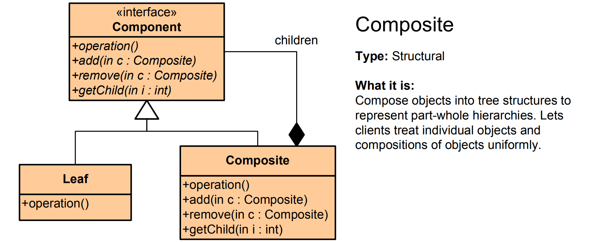

# Composite Pattern - Simple Explanation



## What Is It?

A pattern that treats **individual objects and groups of objects the same way**.

Think: A folder on your computer. A folder can contain files OR other folders. You can open a folder the same way whether it has files or more folders inside.

---

## Real Example: File System

```
📁 MyDocuments/
  ├─ 📄 resume.pdf
  ├─ 📄 cover_letter.doc
  └─ 📁 Projects/
      ├─ 📄 project1.txt
      └─ 📁 SubFolder/
          └─ 📄 file.txt
```

You can:
- Get size of a file → easy
- Get size of a folder (all files inside) → should be the same interface!
- Delete a file → easy
- Delete a folder (all files inside) → should be the same interface!

With Composite, both work the same way.

---

## The Code

### 1. Component Interface (Can be leaf or composite)

```java
public interface FileSystemComponent {
    void display();
    long getSize();
}
```

### 2. Leaf (Individual file)

```java
public class File implements FileSystemComponent {
    private String name;
    private long size;
    
    public File(String name, long size) {
        this.name = name;
        this.size = size;
    }
    
    @Override
    public void display() {
        System.out.println("📄 " + name + " (" + size + " bytes)");
    }
    
    @Override
    public long getSize() {
        return size;
    }
}
```

### 3. Composite (Folder with files/folders inside)

```java
import java.util.ArrayList;
import java.util.List;

public class Folder implements FileSystemComponent {
    private String name;
    private List<FileSystemComponent> children = new ArrayList<>();
    
    public Folder(String name) {
        this.name = name;
    }
    
    public void add(FileSystemComponent component) {
        children.add(component);
    }
    
    @Override
    public void display() {
        System.out.println("📁 " + name);
        for (FileSystemComponent child : children) {
            child.display();  // Same method for files AND folders!
        }
    }
    
    @Override
    public long getSize() {
        long totalSize = 0;
        for (FileSystemComponent child : children) {
            totalSize += child.getSize();  // Same method for files AND folders!
        }
        return totalSize;
    }
}
```

### 4. Use It

```java
public class App {
    public static void main(String[] args) {
        // Create leaves (files)
        File resume = new File("resume.pdf", 500);
        File letter = new File("cover_letter.doc", 300);
        
        // Create composite (folder)
        Folder documents = new Folder("MyDocuments");
        documents.add(resume);
        documents.add(letter);
        
        // Create another folder
        File project1 = new File("project1.txt", 200);
        Folder projects = new Folder("Projects");
        projects.add(project1);
        
        // Add folder to folder (nesting!)
        documents.add(projects);
        
        // Display and get size - SAME METHOD for both files and folders!
        documents.display();
        System.out.println("Total size: " + documents.getSize() + " bytes");
        
        // Output:
        // 📁 MyDocuments
        // 📄 resume.pdf (500 bytes)
        // 📄 cover_letter.doc (300 bytes)
        // 📁 Projects
        // 📄 project1.txt (200 bytes)
        // Total size: 1000 bytes
    }
}
```

---

## Visual

```
          Component (Interface)
          /            \
         /              \
      Leaf            Composite
    (File)           (Folder)
      ❌              ✓ can have children
    no children      can contain Leaves
                     can contain Composites
                     (tree structure!)

┌─────────────────┐
│     MyDocuments │ ◄─── Composite
├─────────────────┤
│ resume.pdf      │ ◄─── Leaf
│ letter.doc      │ ◄─── Leaf
│ Projects/       │ ◄─── Composite (can contain more)
│  ├─ project1.txt│ ◄─── Leaf
│  └─ SubFolder/  │ ◄─── Composite (nested!)
│      └─ file.txt│ ◄─── Leaf
└─────────────────┘
```

---

## Another Example: Organization Hierarchy

```java
// Component
public interface Employee {
    void display();
    double getSalary();
}

// Leaf
public class Developer implements Employee {
    private String name;
    private double salary;
    
    public Developer(String name, double salary) {
        this.name = name;
        this.salary = salary;
    }
    
    @Override
    public void display() {
        System.out.println("👨‍💻 Developer: " + name + " - $" + salary);
    }
    
    @Override
    public double getSalary() {
        return salary;
    }
}

// Composite
public class Department implements Employee {
    private String name;
    private List<Employee> members = new ArrayList<>();
    
    public Department(String name) {
        this.name = name;
    }
    
    public void add(Employee employee) {
        members.add(employee);
    }
    
    @Override
    public void display() {
        System.out.println("📊 Department: " + name);
        for (Employee member : members) {
            member.display();
        }
    }
    
    @Override
    public double getSalary() {
        double total = 0;
        for (Employee member : members) {
            total += member.getSalary();
        }
        return total;
    }
}

// Usage
public class App {
    public static void main(String[] args) {
        Developer dev1 = new Developer("Alice", 80000);
        Developer dev2 = new Developer("Bob", 75000);
        Developer dev3 = new Developer("Charlie", 70000);
        
        Department engineering = new Department("Engineering");
        engineering.add(dev1);
        engineering.add(dev2);
        
        Department qa = new Department("QA");
        qa.add(dev3);
        
        Department company = new Department("TechCorp");
        company.add(engineering);
        company.add(qa);
        
        company.display();
        System.out.println("Total payroll: $" + company.getSalary());
    }
}
```

---

## Another Example: Menu System

```java
// Component
public interface MenuItem {
    void print();
}

// Leaf
public class Item implements MenuItem {
    private String name;
    private double price;
    
    public Item(String name, double price) {
        this.name = name;
        this.price = price;
    }
    
    @Override
    public void print() {
        System.out.println("  " + name + " - $" + price);
    }
}

// Composite
public class Menu implements MenuItem {
    private String name;
    private List<MenuItem> items = new ArrayList<>();
    
    public Menu(String name) {
        this.name = name;
    }
    
    public void add(MenuItem item) {
        items.add(item);
    }
    
    @Override
    public void print() {
        System.out.println("\n" + name);
        System.out.println("─────────");
        for (MenuItem item : items) {
            item.print();  // Works for both Item and Menu!
        }
    }
}

// Usage
Menu mainMenu = new Menu("Restaurant Menu");

Menu appetizers = new Menu("Appetizers");
appetizers.add(new Item("Bread", 5));
appetizers.add(new Item("Soup", 8));

Menu mains = new Menu("Main Course");
mains.add(new Item("Steak", 25));
mains.add(new Item("Fish", 20));

mainMenu.add(appetizers);
mainMenu.add(mains);

mainMenu.print();
```

---

## When to Use?

✅ Part-whole hierarchy (trees)  
✅ Folders containing files and folders  
✅ Organization charts  
✅ UI components (panels contain buttons, which contain text)  
✅ Menu systems  
✅ Graphics (shapes can contain other shapes)

❌ Not everything needs to be composite  
❌ Can be overkill for simple structures

---

## Composite vs Other Patterns

| Pattern | Purpose |
|---------|---------|
| **Composite** | Tree structure (parts & wholes) |
| **Decorator** | Add features to object |
| **Facade** | Simplify complex system |
| **Iterator** | Access elements sequentially |

---

## Real-World Examples

- **File system** (folders contain files/folders)
- **UI frameworks** (panels contain buttons, which contain text)
- **Organization charts** (departments contain employees/departments)
- **XML/HTML** (elements contain elements)
- **Graphics programs** (shapes can contain shapes)
- **Menu systems** (menus contain items/menus)
- **DOM tree** (elements can contain elements)

---

## Key Benefit

**Treat leaves and composites the same way.**

Client code doesn't need to know if it's dealing with a single file or a folder with 1000 files—just call the same methods!

```java
// Works for File (leaf)
file.display();
file.getSize();

// Works for Folder (composite with children)
folder.display();      // displays all children
folder.getSize();      // calculates all children sizes
```

---

## Key Characteristics

✅ Part-whole hierarchy  
✅ Recursive structure (composite can contain composite)  
✅ Uniform treatment (same interface)  
✅ Tree-like structure  
✅ Client code is simple (no special cases)

The Composite pattern is perfect for **representing hierarchies!** 🌳