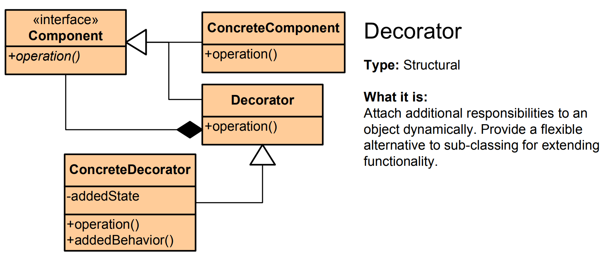

# Decorator Pattern - Simple Explanation



## What Is It?

A pattern that **adds features to an object dynamically** without changing its original class.

Think: A plain coffee cup. You can add cream, sugar, chocolate, etc. Each addition wraps the coffee and adds functionality.

---

## Real Example: Coffee Shop

You have a base coffee:

```
Coffee = $2
Coffee + Milk = $3
Coffee + Milk + Sugar = $3.50
Coffee + Milk + Chocolate = $4
```

Instead of creating 20 different coffee classes, use a **Decorator** that wraps and adds features.

---

## The Code

### 1. Base Component
```java
public interface Coffee {
    double cost();
    String description();
}
```

### 2. Concrete Component (Plain coffee)
```java
public class PlainCoffee implements Coffee {
    @Override
    public double cost() {
        return 2.0;
    }
    
    @Override
    public String description() {
        return "Plain Coffee";
    }
}
```

### 3. Abstract Decorator
```java
public abstract class CoffeeDecorator implements Coffee {
    protected Coffee coffee;
    
    public CoffeeDecorator(Coffee coffee) {
        this.coffee = coffee;
    }
}
```

### 4. Concrete Decorators (Add features)
```java
// Add milk
public class MilkDecorator extends CoffeeDecorator {
    public MilkDecorator(Coffee coffee) {
        super(coffee);
    }
    
    @Override
    public double cost() {
        return coffee.cost() + 0.5;  // Add $0.50
    }
    
    @Override
    public String description() {
        return coffee.description() + " + Milk";
    }
}

// Add sugar
public class SugarDecorator extends CoffeeDecorator {
    public SugarDecorator(Coffee coffee) {
        super(coffee);
    }
    
    @Override
    public double cost() {
        return coffee.cost() + 0.3;  // Add $0.30
    }
    
    @Override
    public String description() {
        return coffee.description() + " + Sugar";
    }
}

// Add chocolate
public class ChocolateDecorator extends CoffeeDecorator {
    public ChocolateDecorator(Coffee coffee) {
        super(coffee);
    }
    
    @Override
    public double cost() {
        return coffee.cost() + 1.0;  // Add $1.00
    }
    
    @Override
    public String description() {
        return coffee.description() + " + Chocolate";
    }
}
```

### 5. Use It
```java
public class CoffeeShop {
    public static void main(String[] args) {
        // Start with plain coffee
        Coffee coffee = new PlainCoffee();
        System.out.println(coffee.description() + " - $" + coffee.cost());
        // Output: Plain Coffee - $2.0
        
        // Add milk
        coffee = new MilkDecorator(coffee);
        System.out.println(coffee.description() + " - $" + coffee.cost());
        // Output: Plain Coffee + Milk - $2.5
        
        // Add sugar
        coffee = new SugarDecorator(coffee);
        System.out.println(coffee.description() + " - $" + coffee.cost());
        // Output: Plain Coffee + Milk + Sugar - $2.8
        
        // Add chocolate
        coffee = new ChocolateDecorator(coffee);
        System.out.println(coffee.description() + " - $" + coffee.cost());
        // Output: Plain Coffee + Milk + Sugar + Chocolate - $3.8
    }
}
```

---

## Visual

```
PlainCoffee ($2)
    ↓ wrap with decorator
MilkDecorator ($2.5)
    ↓ wrap with decorator
SugarDecorator ($2.8)
    ↓ wrap with decorator
ChocolateDecorator ($3.8)
```

Each decorator **wraps** the previous one and adds features.

---

## Another Example: File Encryption

```java
// Base interface
public interface DataStream {
    void read();
}

// Plain file
public class FileStream implements DataStream {
    public void read() {
        System.out.println("Reading file...");
    }
}

// Decorator: Add encryption
public class EncryptionDecorator implements DataStream {
    private DataStream stream;
    
    public EncryptionDecorator(DataStream stream) {
        this.stream = stream;
    }
    
    public void read() {
        System.out.println("Decrypting...");
        stream.read();
    }
}

// Decorator: Add compression
public class CompressionDecorator implements DataStream {
    private DataStream stream;
    
    public CompressionDecorator(DataStream stream) {
        this.stream = stream;
    }
    
    public void read() {
        System.out.println("Decompressing...");
        stream.read();
    }
}

// Usage
public class App {
    public static void main(String[] args) {
        DataStream file = new FileStream();
        file = new EncryptionDecorator(file);
        file = new CompressionDecorator(file);
        
        file.read();
        // Output:
        // Decompressing...
        // Decrypting...
        // Reading file...
    }
}
```

---

## When to Use?

✅ Add features dynamically at runtime  
✅ Too many subclass combinations (explosion problem)  
✅ Keep original class unchanged  
✅ Stack multiple behaviors

❌ Can create many small objects  
❌ Order matters (decorators wrap in specific order)  
❌ More complex than inheritance

---

## Decorator vs Inheritance

| | Inheritance | Decorator |
|---|---|---|
| **Add features** | Create new subclass | Wrap with decorator |
| **Combinations** | Explosion of classes | Flexible combinations |
| **Runtime** | Fixed at compile time | Dynamic at runtime |
| **Original** | Changes base class | Leaves original untouched |

---

## Real-World Examples

- **Coffee shop** (base coffee + toppings)
- **Java I/O** (FileInputStream → BufferedInputStream → GZIPInputStream)
- **Text formatting** (bold, italic, underline)
- **UI components** (panels with borders, scrollbars, shadows)
- **Encryption/compression** (add layers of security)

---

## Key Benefit

**Add unlimited combinations of features without creating explosion of classes.**

Plain feature A, B, A+B, A+C, B+C, A+B+C = Use decorators instead of 8 different classes!