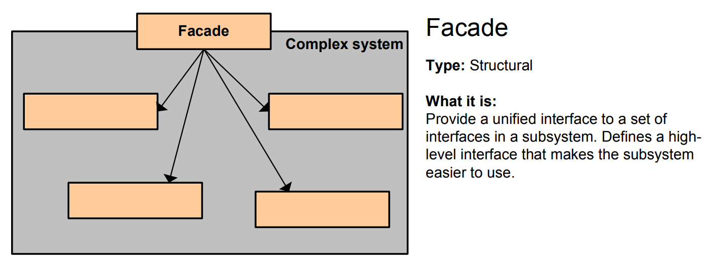

# Facade Pattern - Simple Explanation



## What Is It?

A pattern that provides **one simple interface** to hide a complex system underneath.

Think: A car. You just press the gas pedal and go. You don't care about the engine, transmission, fuel injection, spark plugs. The car's interface (steering wheel, pedals) is a **facade** hiding all the complexity.

---

## Real Example: Home Theater System

Without Facade, you need to do this:

```java
projector.on();
projector.setInput("DVD");
dvdPlayer.on();
dvdPlayer.play("movie.mp4");
amplifier.on();
amplifier.setVolume(10);
lights.dim(20);
```

That's **6 steps** for one action!

With Facade, you just do:

```java
homeTheater.watchMovie("movie.mp4");
```

---

## The Code

### 1. Complex Subsystems (Hidden)

```java
// Subsystem 1
public class Projector {
    public void on() {
        System.out.println("Projector on");
    }
    public void setInput(String input) {
        System.out.println("Projector input: " + input);
    }
}

// Subsystem 2
public class DVDPlayer {
    public void on() {
        System.out.println("DVD player on");
    }
    public void play(String movie) {
        System.out.println("Playing: " + movie);
    }
}

// Subsystem 3
public class Amplifier {
    public void on() {
        System.out.println("Amplifier on");
    }
    public void setVolume(int level) {
        System.out.println("Volume: " + level);
    }
}

// Subsystem 4
public class Lights {
    public void dim(int level) {
        System.out.println("Lights dimmed to: " + level + "%");
    }
}
```

### 2. Facade (Simple interface)

```java
public class HomeTheaterFacade {
    private Projector projector;
    private DVDPlayer dvdPlayer;
    private Amplifier amplifier;
    private Lights lights;
    
    public HomeTheaterFacade(Projector projector, DVDPlayer dvdPlayer,
                             Amplifier amplifier, Lights lights) {
        this.projector = projector;
        this.dvdPlayer = dvdPlayer;
        this.amplifier = amplifier;
        this.lights = lights;
    }
    
    // Simple method hides complexity
    public void watchMovie(String movie) {
        System.out.println("Getting ready to watch a movie...\n");
        lights.dim(20);
        projector.on();
        projector.setInput("DVD");
        amplifier.on();
        amplifier.setVolume(10);
        dvdPlayer.on();
        dvdPlayer.play(movie);
    }
    
    // Another simple method
    public void endMovie() {
        System.out.println("Shutting down the theater...\n");
        dvdPlayer.off();
        amplifier.off();
        projector.off();
        lights.on();
    }
}
```

### 3. Use It

```java
public class App {
    public static void main(String[] args) {
        // Create subsystems
        Projector projector = new Projector();
        DVDPlayer dvdPlayer = new DVDPlayer();
        Amplifier amplifier = new Amplifier();
        Lights lights = new Lights();
        
        // Create facade
        HomeTheaterFacade theater = new HomeTheaterFacade(
            projector, dvdPlayer, amplifier, lights
        );
        
        // Use simple interface instead of complex system
        theater.watchMovie("The Matrix");
        // Output:
        // Getting ready to watch a movie...
        // Lights dimmed to: 20%
        // Projector on
        // Projector input: DVD
        // Amplifier on
        // Volume: 10
        // DVD player on
        // Playing: The Matrix
        
        theater.endMovie();
    }
}
```

---

## Visual

```
┌──────────────────────────────────┐
│   Client Code                    │
│   (Just calls watchMovie())      │
└────────────────┬─────────────────┘
                 │
                 ▼
┌──────────────────────────────────┐
│   HomeTheaterFacade              │ ◄─── Simple interface
│   - watchMovie()                 │
│   - endMovie()                   │
└────────────────┬─────────────────┘
                 │
    ┌────────────┼────────────┬───────────┐
    ▼            ▼            ▼           ▼
┌────────┐  ┌──────────┐  ┌──────────┐  ┌──────┐
│Projector│  │DVDPlayer │  │Amplifier │  │Lights│
└────────┘  └──────────┘  └──────────┘  └──────┘
   (Complex subsystems hidden behind facade)
```

---

## Another Example: Banking System

```java
// Subsystems
public class AccountService {
    public boolean checkBalance(String account, double amount) {
        System.out.println("Checking balance...");
        return true;
    }
}

public class TransferService {
    public void transfer(String from, String to, double amount) {
        System.out.println("Transferring $" + amount);
    }
}

public class NotificationService {
    public void sendEmail(String email, String message) {
        System.out.println("Email sent: " + message);
    }
}

public class LoggingService {
    public void log(String action) {
        System.out.println("Logged: " + action);
    }
}

// Facade
public class BankingFacade {
    private AccountService accountService;
    private TransferService transferService;
    private NotificationService notificationService;
    private LoggingService loggingService;
    
    public BankingFacade(AccountService acc, TransferService trans,
                         NotificationService notif, LoggingService log) {
        this.accountService = acc;
        this.transferService = trans;
        this.notificationService = notif;
        this.loggingService = log;
    }
    
    // Simple method hides 4 subsystems
    public void sendMoney(String from, String to, double amount, String email) {
        if (accountService.checkBalance(from, amount)) {
            transferService.transfer(from, to, amount);
            notificationService.sendEmail(email, "Transfer successful");
            loggingService.log("Transferred $" + amount);
        }
    }
}

// Usage
public class App {
    public static void main(String[] args) {
        BankingFacade bank = new BankingFacade(
            new AccountService(),
            new TransferService(),
            new NotificationService(),
            new LoggingService()
        );
        
        // One simple call instead of 4 separate calls
        bank.sendMoney("ACC123", "ACC456", 100, "user@email.com");
    }
}
```

---

## When to Use?

✅ System is complex with many interdependent classes  
✅ Want to simplify client interaction  
✅ Hide implementation details  
✅ Reduce dependencies  
✅ Provide clean, easy-to-use interface

❌ Don't overuse - not everything needs a facade  
❌ Can hide useful functionality

---

## Facade vs Other Patterns

| Pattern | Purpose |
|---------|---------|
| **Facade** | Simplify complex system |
| **Adapter** | Make incompatible interfaces work |
| **Decorator** | Add features to object |
| **Factory** | Create objects |

---

## Real-World Examples

- **Car** (steering wheel, pedals hide engine complexity)
- **Phone** (simple UI hides complicated electronics)
- **Restaurant** (waiter hides kitchen complexity)
- **Java I/O** (FileInputStream hides OS details)
- **Spring Framework** (@SpringBootApplication hides configuration)
- **Payment API** (one payment() method hides validation, encryption, logging)

---

## Key Benefit

**Hide messy complexity behind one simple, clean interface.**

Client doesn't need to know about all the subsystems—just call the facade method!

---

## Pattern Comparison

```
Facade:  Many classes → One simple method
Adapter: Old interface → New interface
Bridge:  Abstraction → Implementation
Proxy:   Same interface + control access
```

Facade is about **simplicity and convenience** ✨