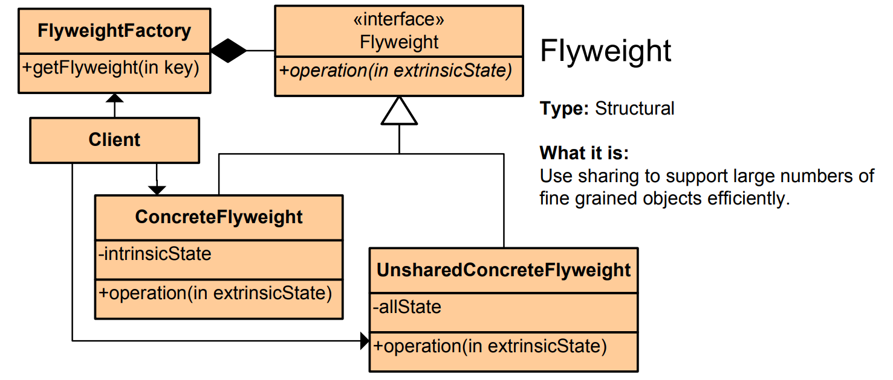

# Flyweight Pattern - Simple Explanation




## What Is It?

A pattern that **shares common data between many objects** to save memory.

Think: A chess game. You have many chess pieces (pawns, knights, etc.). Instead of each pawn having its own "pawn image" (which is huge), all pawns share ONE image and only remember their position on the board.

---

## Real Example: Video Game - Trees

Without Flyweight:
```
Forest with 10,000 trees
Each tree = 1MB (image, texture, model)
Total = 10,000 MB = 10 GB! 💥
```

With Flyweight:
```
1 shared tree model = 1MB
10,000 trees just store position
Total = 1MB + positions = tiny! ✨
```

---

## The Code

### 1. Shared Data (Intrinsic State)

```java
public class TreeType {
    private String name;
    private String color;
    private byte[] texture;  // Heavy data
    
    public TreeType(String name, String color, byte[] texture) {
        this.name = name;
        this.color = color;
        this.texture = texture;
    }
    
    public void draw(int x, int y) {
        System.out.println("Drawing " + name + " at (" + x + ", " + y + ")");
    }
}
```

### 2. Flyweight Object (Stores shared + unique data)

```java
public class Tree {
    private int x, y;                    // Unique (position)
    private TreeType type;               // Shared (image, color)
    
    public Tree(int x, int y, TreeType type) {
        this.x = x;
        this.y = y;
        this.type = type;
    }
    
    public void draw() {
        type.draw(x, y);
    }
}
```

### 3. Flyweight Factory (Cache shared objects)

```java
import java.util.HashMap;
import java.util.Map;

public class TreeFactory {
    private static Map<String, TreeType> treeTypes = new HashMap<>();
    
    public static TreeType getTreeType(String name, String color, byte[] texture) {
        String key = name + color;
        
        // Return cached object if exists
        if (!treeTypes.containsKey(key)) {
            treeTypes.put(key, new TreeType(name, color, texture));
            System.out.println("Creating new tree type: " + key);
        } else {
            System.out.println("Reusing tree type: " + key);
        }
        
        return treeTypes.get(key);
    }
}
```

### 4. Use It

```java
public class Forest {
    private Tree[] trees = new Tree[10000];
    
    public void plantTrees() {
        // Get shared tree types from factory
        TreeType oak = TreeFactory.getTreeType("Oak", "Green", new byte[1000]);
        TreeType pine = TreeFactory.getTreeType("Pine", "DarkGreen", new byte[1000]);
        
        // Create 10,000 trees (each only stores position!)
        for (int i = 0; i < 10000; i++) {
            int x = (int) (Math.random() * 1000);
            int y = (int) (Math.random() * 1000);
            
            // Alternate between oak and pine
            TreeType type = (i % 2 == 0) ? oak : pine;
            trees[i] = new Tree(x, y, type);
        }
    }
    
    public void draw() {
        for (Tree tree : trees) {
            tree.draw();
        }
    }
    
    public static void main(String[] args) {
        Forest forest = new Forest();
        forest.plantTrees();
        forest.draw();
        
        // Output:
        // Creating new tree type: OakGreen
        // Reusing tree type: OakGreen
        // Creating new tree type: PineDarkGreen
        // Reusing tree type: PineDarkGreen
        // Drawing Oak at (234, 567)
        // Drawing Pine at (123, 456)
        // ...
    }
}
```

---

## Visual

```
WITHOUT FLYWEIGHT (Memory waste):
┌─────────────────┐
│ Tree 1          │
│ - Image (1MB)   │
│ - Color         │
│ - Position      │
└─────────────────┘
        × 10,000 = 10 GB!

WITH FLYWEIGHT (Memory efficient):
┌──────────────────────┐
│  TreeFactory         │
│  ┌────────────────┐  │
│  │ Shared TreeType│  │ ◄─── One copy shared!
│  │ - Image (1MB)  │  │
│  │ - Color        │  │
│  └────────────────┘  │
└──────────────────────┘
         ↑ referenced by
┌────────┴─────────────────────────┐
│ Tree 1 (x, y, ref)               │
│ Tree 2 (x, y, ref) ← Same type!  │
│ Tree 3 (x, y, ref)               │
│ ...                              │
└──────────────────────────────────┘
Total = 1MB + (10,000 positions) = Small!
```

---

## Another Example: Text Editor

```java
// Shared character data
public class CharacterFont {
    private char character;
    private String fontName;
    private int size;
    
    public CharacterFont(char character, String fontName, int size) {
        this.character = character;
        this.fontName = fontName;
        this.size = size;
    }
    
    public void render(int row, int column) {
        System.out.println("Render '" + character + "' at (" + row + ", " + column + ")");
    }
}

// Flyweight - character with position
public class TextCharacter {
    private int row, column;
    private CharacterFont font;
    
    public TextCharacter(int row, int column, CharacterFont font) {
        this.row = row;
        this.column = column;
        this.font = font;
    }
    
    public void render() {
        font.render(row, column);
    }
}

// Factory
public class CharacterFactory {
    private static Map<String, CharacterFont> fonts = new HashMap<>();
    
    public static CharacterFont getCharacter(char c, String fontName, int size) {
        String key = c + fontName + size;
        if (!fonts.containsKey(key)) {
            fonts.put(key, new CharacterFont(c, fontName, size));
        }
        return fonts.get(key);
    }
}

// Usage - 1 million characters, shared fonts
public class Document {
    private TextCharacter[] characters = new TextCharacter[1000000];
    
    public void loadDocument() {
        CharacterFont aFont = CharacterFactory.getCharacter('a', "Arial", 12);
        CharacterFont bFont = CharacterFactory.getCharacter('b', "Arial", 12);
        
        // Million 'a's all share same font!
        for (int i = 0; i < 500000; i++) {
            characters[i] = new TextCharacter(i / 100, i % 100, aFont);
        }
    }
}
```

---

## Another Example: String Interning (Java Built-in)

```java
// Java strings are flyweights!
String s1 = "Hello";
String s2 = "Hello";

// Both point to SAME object in memory!
System.out.println(s1 == s2);  // true

// Java caches strings automatically
String s3 = "World";
String s4 = "World";
System.out.println(s3 == s4);  // true (shared!)
```

---

## Intrinsic vs Extrinsic State

| State | Where | Example |
|-------|-------|---------|
| **Intrinsic** | Shared (in flyweight) | Tree image, color |
| **Extrinsic** | Unique (outside) | Tree position (x, y) |

**Rule:** Move expensive data to intrinsic, keep unique data extrinsic.

---

## When to Use?

✅ **Many similar objects** consuming lots of memory  
✅ Memory is a concern (games, graphics, servers)  
✅ Can share state between objects  
✅ Object state can be split into shared + unique

❌ Few objects (no memory savings)  
❌ Objects are completely different  
❌ Memory isn't a constraint

---

## Real-World Examples

- **Video games** (10,000 trees, 1 model)
- **Text editors** (1M characters, shared fonts)
- **Chess/Board games** (pieces with shared type)
- **String pooling** (Java caches strings)
- **Database connections** (connection pool)
- **Sprite atlases** (games share textures)
- **Thread pools** (reuse threads)

---

## Key Benefit

**Reduce memory by sharing common data.**

Instead of storing 10,000 copies of "oak tree image", store it ONCE and all trees reference it!

```
10,000 trees × 1MB each = 10GB
vs
1 tree model + 10,000 positions = ~1KB!
```

**Massive savings!** 💾

---

## Pattern Comparison

```
Flyweight:   Share intrinsic state, reduce memory
Factory:     Create objects
Singleton:   One instance globally
Pool:        Reuse objects
```

Flyweight is about **sharing to save memory** 🎮