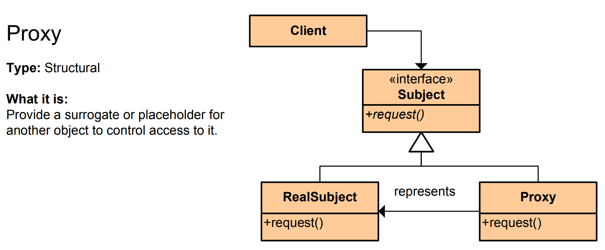

# Proxy Pattern - Simple Explanation


## What Is It?

A pattern that provides a **substitute or placeholder** for another object to control access to it.

Think: A celebrity's agent. You don't contact the celebrity directly. You contact the agent (proxy) who controls access, manages appointments, and protects the celebrity.

---

## Real Example: Database Connection

Without Proxy - Direct connection:
```java
database.query("SELECT * FROM users");
```

With Proxy - Controlled connection:
```java
DatabaseProxy db = new DatabaseProxy();
db.query("SELECT * FROM users");  // Proxy checks permissions first!
```

The proxy can:
- Check if user has permission
- Log all queries
- Cache results
- Delay expensive operations

---

## The Code

### 1. Subject Interface

```java
public interface Database {
    void query(String sql);
}
```

### 2. Real Subject (Expensive to create)

```java
public class RealDatabase implements Database {
    public RealDatabase() {
        System.out.println("Creating expensive database connection...");
        // Expensive operation
    }
    
    @Override
    public void query(String sql) {
        System.out.println("Executing query: " + sql);
    }
}
```

### 3. Proxy (Controls access)

```java
public class DatabaseProxy implements Database {
    private RealDatabase database;
    private String userRole;
    
    public DatabaseProxy(String userRole) {
        this.userRole = userRole;
    }
    
    @Override
    public void query(String sql) {
        // Check permission
        if (!isAuthorized()) {
            System.out.println("Access denied! Only admins can query.");
            return;
        }
        
        // Lazy initialization - create only when needed
        if (database == null) {
            database = new RealDatabase();
        }
        
        // Log the action
        System.out.println("Logging query from user: " + userRole);
        
        // Execute query
        database.query(sql);
    }
    
    private boolean isAuthorized() {
        return userRole.equals("admin");
    }
}
```

### 4. Use It

```java
public class App {
    public static void main(String[] args) {
        // Admin user
        Database db = new DatabaseProxy("admin");
        db.query("SELECT * FROM users");
        // Output:
        // Logging query from user: admin
        // Creating expensive database connection...
        // Executing query: SELECT * FROM users
        
        System.out.println();
        
        // Regular user
        Database db2 = new DatabaseProxy("user");
        db2.query("SELECT * FROM users");
        // Output:
        // Access denied! Only admins can query.
    }
}
```

---

## Visual

```
┌────────────┐
│   Client   │
└─────┬──────┘
      │ calls
      ▼
┌──────────────────────────────────┐
│   DatabaseProxy                  │ ◄─── Control point
│ - Check permission               │
│ - Log actions                    │
│ - Lazy load real object          │
└──────────┬───────────────────────┘
           │ uses (only if authorized)
           ▼
┌──────────────────────────────────┐
│   RealDatabase                   │
│ (Expensive, actual implementation)
└──────────────────────────────────┘
```

---

## Another Example: Lazy Loading Images

```java
// Subject
public interface Image {
    void display();
}

// Real subject - expensive to load
public class RealImage implements Image {
    private String url;
    
    public RealImage(String url) {
        this.url = url;
        System.out.println("Loading image from: " + url);
        // Expensive operation - downloading image
    }
    
    @Override
    public void display() {
        System.out.println("Displaying image: " + url);
    }
}

// Proxy - delays loading until needed
public class ImageProxy implements Image {
    private String url;
    private RealImage realImage;
    
    public ImageProxy(String url) {
        this.url = url;  // Don't load yet!
    }
    
    @Override
    public void display() {
        if (realImage == null) {
            realImage = new RealImage(url);  // Load only when needed
        }
        realImage.display();
    }
}

// Usage
public class App {
    public static void main(String[] args) {
        Image img = new ImageProxy("http://example.com/photo.jpg");
        // Image NOT loaded yet!
        
        System.out.println("Image created");
        System.out.println("Doing other work...");
        
        // Only load when we actually need it
        img.display();
        // Output:
        // Image created
        // Doing other work...
        // Loading image from: http://example.com/photo.jpg
        // Displaying image: http://example.com/photo.jpg
    }
}
```

---

## Another Example: API Rate Limiting

```java
public interface APIClient {
    String fetchData(String endpoint);
}

public class RealAPIClient implements APIClient {
    @Override
    public String fetchData(String endpoint) {
        System.out.println("Fetching from: " + endpoint);
        return "Data from " + endpoint;
    }
}

public class APIProxy implements APIClient {
    private RealAPIClient client;
    private int requestCount = 0;
    private static final int RATE_LIMIT = 5;
    
    @Override
    public String fetchData(String endpoint) {
        // Control rate limiting
        if (requestCount >= RATE_LIMIT) {
            System.out.println("Rate limit exceeded!");
            return null;
        }
        
        requestCount++;
        System.out.println("Request " + requestCount + "/" + RATE_LIMIT);
        
        if (client == null) {
            client = new RealAPIClient();
        }
        
        return client.fetchData(endpoint);
    }
}
```

---

## Types of Proxy

| Type | Purpose | Example |
|------|---------|---------|
| **Protection Proxy** | Control access | Database - check permissions |
| **Virtual Proxy** | Lazy loading | Images - load when needed |
| **Logging Proxy** | Track calls | API - log all requests |
| **Caching Proxy** | Store results | Web - cache responses |
| **Remote Proxy** | Network communication | RPC - call remote server |

---

## When to Use?

✅ Control access to sensitive objects  
✅ Delay expensive operations (lazy loading)  
✅ Log or monitor access  
✅ Cache results  
✅ Add security checks  
✅ Control network communication

❌ Can add unnecessary complexity  
❌ Slight performance overhead

---

## Proxy vs Similar Patterns

| Pattern | Purpose |
|---------|---------|
| **Proxy** | Control access to real object |
| **Adapter** | Change interface |
| **Decorator** | Add features |
| **Facade** | Simplify complex system |

---

## Real-World Examples

- **Agent/Manager** (celebrity's agent controls access)
- **Security guard** (checks ID before letting people in)
- **Spring @Transactional** (proxy adds transaction management)
- **Java RMI** (remote proxy for network calls)
- **Hibernate lazy loading** (proxy loads objects only when accessed)
- **Virtual machines** (proxy to actual hardware)
- **CDN** (proxy caches and serves content)

---

## Key Benefit

**Intercept and control access without changing the original object.**

The client doesn't know it's using a proxy—it looks the same! But the proxy can add security, logging, caching, lazy loading, etc.

---

## Quick Comparison

```
Proxy:     Same interface, control access
Adapter:   Different interface, make compatible
Decorator: Same interface, add features
Facade:    Simplify complex system
```

Proxy is about **control and protection** 🛡️